# Certified Joint Pricing Errors in Rough Heston

**Theodore Ouyang**  
[theodore.oy2025@gmail.com](mailto:theodore.oy2025@gmail.com) · [10@alumni.duke.edu](mailto:10@alumni.duke.edu)

[Project overview](README.md) · [Code and evidence](EVIDENCE.md)

## Contents

[Introduction](#1-introduction) · [Model](#2-model-units-and-fixed-configurations) · [Propagation theorem](#3-finite-history-propagation-nonexpansion-and-dissipation) · [Continuous certificates](#4-continuous-certificates-and-complete-fourier-prices) · [Joint tasks](#5-shared-errors-and-financial-decisions) · [Rational construction](#6-structure-of-the-specified-rational-output) · [Experiments](#7-matched-decisions-and-scientific-controls) · [Scope](#8-scope-and-reproducibility)

[Appendix A](#appendix-a-probability-model-and-strip-transform) · [Appendix B](#appendix-b-exact-construction-and-structural-certificates) · [Appendix C](#appendix-c-complete-propagation-proofs-and-analytic-variants) · [Appendix D](#appendix-d-continuous-certification-and-reliable-refinement) · [Appendix E](#appendix-e-complete-experiments-and-verification-duties) · [Appendix F](#appendix-f-original-chain-classical-heston-inclusion) · [Appendix G](#appendix-g-nonexact-trial-fields-and-the-signed-error-identity) · [Appendix H](#appendix-h-research-timeline) · [References](#references)

## Abstract

We give deterministic error bounds for stored rough Heston pricing outputs, retaining the complex Fourier perturbation shared by different strikes. A finite-history theorem carries a continuous fractional Riccati residual into the pricing exponent, with the curve initial term and physical scaling intact. It gives a curve-weighted bound under nonexpansion and a sharper resolvent bound under positive dissipation. Certified transform disks, finite omitted frequencies, strip quadrature, the infinite tail and arithmetic then yield complete price, portfolio and finite-candidate objective enclosures. For a quarter-year spread, the joint bound is 0.233318843 index points and the marginal bound is 0.252393939: retaining the shared errors changes the decision at a quarter-point budget. A fixed five-point roughness grid and direct-reference, corrected-output and modified-Adams controls use the same market quotes. Their error accounts separate history weighting, shared geometry, reference uncertainty and changes of centre. An exact algebraic cover also establishes the specified rational construction on a narrow continuous parameter domain. The price certificate uses an independent reference field. Appendices give the regularity and residual proofs, verification procedures, and classical common-state extensions. The bounds concern numerical error relative to the model price; market fit and the true error of a nominal solver are assessed separately.

**Keywords:** rough Heston; continuous residual; finite history; actual output; joint pricing error; deterministic certification.

Sections 2–5 develop the pricing certificate; Sections 7.1 and 7.5–7.6 give the matched experiments. Appendices C–E contain the proofs, residual construction and verification procedures. Section 6 and Appendix B treat the rational construction, Appendices F–G the classical extensions, and Appendix H the research timeline.

## 1. Introduction

At a fixed model parameter and maturity, different strikes use the same Fourier transform values. Bounding each price separately discards a constraint: the error at each frequency is one common complex number. We retain these common variables in the price-error set and ask whether they can change a financial certification decision. The resulting dependence is deterministic and comes from the pricing formula.

Let $`c^*`$ denote the model-price vector, $`c^{\rm fast}`$ the stored pricing output, and $`\bar c`$ an independent reference centre. The complete inclusion is

Each component of $`\delta`$ is a rigorously enclosed common Fourier error. Finite omitted frequencies remain in $`\delta`$; the remainder $`r`$ retains strip quadrature, the true infinite tail and arithmetic, without charging those finite nodes twice. A reference refinement changes $`d`$ and its certified uncertainty together. Neither the reference price nor the fast output is identified with the exact model price.

### 1.1. Contributions and dependencies

The main analytical result connects a complex Riccati residual to the Heston exponent through a finite-history kernel. Theorem 3.1 gives the nonexpansive curve bound and the positive-dissipation envelope, including the initial curve term and physical factor $`\nu^{-1}`$. The comparison uses established Caputo convexity and positive-resolvent results. We compose that comparison with the model's pricing functional, certify the history weights, and include them in the complete output budget.

The second result is a certificate for the actual pricing output. Shared transform disks are translated to that output and evaluated in portfolio and finite-objective directions. A matched quarter-year comparison isolates the contribution of shared errors to the budget decision. The ablation separates propagation, time-local envelopes, omitted-frequency certification and recentering. Support functions, convexity and sorting a fully known unit-cost menu are the tools used in this construction.

The third result certifies a structural domain for the Gatheral–Radoicic rational construction. The all-frequency statement has explicit restrictions on correlation, fractional order and mean reversion. An independently generated reference field supplies the residual certificate used for prices. Nearby candidates and output controls test the financial decisions and the reuse of that certificate.

**Table 1. Dependencies of the rational-output and independent-reference proof chains.**

| Proof chain | Inputs and conclusion | Role in the price certificate |
|---|---|---|
| Rational construction | Endpoint matching, raw determinant and numerator signs; well-defined Padé output and left-half-plane structure | Defines and checks the specified production formula on its stated domain |
| Independent reference | Fixed field, full continuous residual, dissipation, finite-history exponent and complete Fourier error | Certifies the reference transform and model-price inclusion |
| Output translation | Stored fast values and independently enclosed reference centre | Converts the reference inclusion into error of the actual output |

The two proof chains share the model but certify different objects. The algebraic signs establish the rational output's structural properties; the continuous residual establishes the reference error. Output translation connects the latter to the stored Padé price.

### 1.2. Related work

Gatheral--Radoicic [GR2019, GR2023] construct two-end rational approximations. Jeng--Kilicman [JK2020, JK2021] analyse global Padé approximations and public SPX data. The formula and endpoint-matching method used here are theirs. Our structural statement concerns the raw matching system throughout its explicitly certified domain.

Abi Jaber–El Euch [AbiJaberElEuch2018] give the Volterra model and affine transform. Li–Liu [LiLiu2018] establish Caputo convexity through regularization; Kopteva [Kopteva2021] propagates a time-dependent residual with a positive fractional inverse. Simon [SimonCM2015] gives Mittag–Leffler positivity, and Trefethen–Weideman [TrefethenWeideman2014] give strip trapezoidal analysis. Appendix C proves the regularity statements needed to apply these results to the pricing functional.

Ben Hammouda et al. [BenHammouda2026, Section 3.2] develop error-controlled multilevel rough-Heston quadrature. Their practical tolerance procedure replaces unavailable constants with numerical error indicators and assesses tolerance attainment numerically. Our certificate instead encloses a stored output a posteriori, including tails and arithmetic. This comparison concerns the tolerance procedure in the cited paper.

Boyarchenko–de Innocentis–Levendorskii [BL2025] study reliable pricing, numerical bias and incorrect calibration. We use their modified Adams method as a numerical control. They describe Conformal Bootstrap as an ad-hoc principle; it does not supply a deterministic interval enclosure. Hager–Kreher [HK2026] study analytic expansions in the Hurst parameter and local convergence. Bayer–Breneis [BBWeak2023, BBSimulation2023] bound Markovian kernel approximations and investigate low-dimensional simulation. Each comparison below specifies the model, numerical output and error guarantee.

Appendices F–G give a separate classical Heston extension based on common occupation probabilities and an inexact trial field. Its terminal witness establishes strict improvement of an outer error set. A complete annual monetary certificate remains open.

## 2. Model, units and fixed configurations

Our conventions for the fractional integral and Caputo derivative are

Under the regularity of the trajectories used below, $`I^\alpha f\in AC`$ with zero initial value, so $`D_C^\alpha I^\alpha f=f`$. The Caputo operator and all time scalings retain their fractional definitions. Set $`a=u-i/2`$. The physical Riccati state $`h`$ satisfies

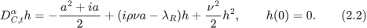

Define

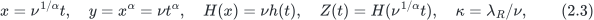

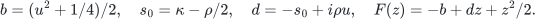

Then $`D_{C,x}^\alpha H=F(H)`$ and $`D_{C,t}^\alpha Z=\nu F(Z)`$. Dividing the normalised state error by $`\nu`$ gives the physical $`h`$ error. Likewise, dividing the physical residual $`r_t=D_t^\alpha\widehat Z-\nu F(\widehat Z)`$ by $`\nu`$ gives the residual bound for the normalised equation.

For pricing and the numerical example, we fix $`\kappa=0`$ and the entire forward variance curve

The curve parameter $`\lambda_\xi`$ and Riccati parameter $`\lambda_R`$ are defined separately. Curve (2.4) remains fixed when the candidate $`\alpha`$ changes. The probability model is

Equation (2.5) is the forward variance representation with zero Riccati mean reversion. Appendix A verifies the probability model and affine transform associated with this curve using Theorems 2.1 and 2.3 and Example 2.2 of Abi Jaber and El Euch.

Let $`M_T=S_T/F_T`$ be the normalised positive martingale and write $`\phi_T(a)=\mathbb E M_T^{ia}`$. The exact characteristic exponent is

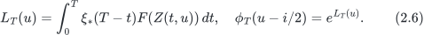

With $`m=K/F_T,k=\log m,c=C/(DF_T)`$, the model European call price is

The model specification, decimal inputs, and normalisation jointly define the prices considered below.

All experiments use model parameter $`\nu=0.2897`$, $`\rho=-0.7445`$, Riccati mean reversion zero, Fourier step $`1/8`$, a finite reference/error grid through 128 (1025 nodes), 100-bit outward dyadic arithmetic and 64 forward-moment series terms. The actual Padé output uses composite Gauss–Legendre order 8 through 200 (352 nodes) and Jacobi order 256; its Fourier cutoff is distinct from the certificate cutoff. $`N_t`$ counts source time cells. The number of frequency nodes is written explicitly to avoid confusing it with $`\nu`$.

**Table 2. Fixed configurations: maturity in years; time cells, reference nodes, residual subcells and history bins are counts.**

| ID | T | alpha | N_t source cells | nonzero ref nodes | zero finite nodes | subcells | history bins |
| --- | --- | --- | --- | --- | --- | --- | --- |
| H0 | 1/2 | 13/25, 3/5, 9/10 | 2048 / 2048 / 1024 | 513 | 512 | 4 | 0 |
| H1 | 1/2 | 13/25, 3/5, 9/10 | 2048 / 2048 / 1024 | 513 | 512 | 4 | 1 |
| H2 | 1/2 | 13/25 | 2048 | 513 | 512 | 4 | 128 |
| H3 | 1/2 | 13/25 | 2048 | 1025 | 0 | 4 | low128; high1 |
| H4 | 1/2 | 13/25 | 2048 | 1025 | 0 | 4 | 128 |
| Q0 | 1/4 | 13/25, 3/5, 9/10 | 1429 / 1352 / 549 | 513 | 512 | 4 | 1 |
| Q1 | 1/4 | 13/25 | 1429 | 1025 | 0 | 4 | 1 |
| Q2 | 1/4 | 13/25 | 1429 | 1025 | 0 | 4 | 128 |
| N1 | 1/2 | 13/25, 21/40, 53/100, 27/50, 11/20 | 1024 | 513 | 512 | 2 | 1 |
| N2 | 1/2 | 13/25, 21/40, 53/100, 27/50, 11/20 | 2048 | 513 | 512 | 2 | 1 |
| N2L | 1/2 | 13/25 | 2048 | 513 | 512 | 2 | 128 |

H0 uses uniform-state propagation; H1 uses finite-horizon global propagation on the same field. H2 uses the low-frequency 128-bin bank. H3/H4 extend the reference through 128, retaining that low bank and using global/128-bin propagation for the high bank. Q0/Q1/Q2 retain the full history from zero and use exact quarter-terminal interpolation of the half-year field: Q0 has 1430/1353/550 time knots, and Q1/Q2 have 1430 knots. They reuse the larger-horizon continuous banks and recompute quarter moments, output and tails. The alpha=.9 source field has 1025 time knots and 641 stored frequencies through 80; 513 of these are nonzero reference nodes in H0/H1/Q0. The .52/.60 fields have 2049 knots and 1025 stored frequencies through 128.

N1/N2 generate each five-point field and continuous residual bank, using two nonstartup subcells (2047/4095 closed cells). N2L is a separate descriptive 128-bin reuse of N2 at alpha=.52. The nearby-grid objective experiment uses N1/N2. The H low and high banks each have 8189 closed cells (four nonstartup subcells), for 513 and 512 frequencies respectively. Thus the 0.115215934-point H4 certificate and 0.394999331-point N2L certificate use different reference centres, node coverage and residual banks; their difference includes more than 128-bin propagation. BL-core512/1024 are nominal history-stepping controls whose complete guarantees use the identified N1/N2/N2L reference bank.

The H and N field generators use a uniform auxiliary grid $`y_j`$ from zero to $`\nu T^\alpha`$, followed by $`x_j=y_j^{1/\alpha}`$ and $`t_j=x_j/\nu^{1/\alpha}`$. In exact arithmetic this is the graded rule $`t_j=T(j/N_t)^{1/\alpha}`$. Generation uses binary64 arithmetic and forces the endpoints to zero and one half; certification uses the saved nodes as exact dyadics, rather than identifying them with the analytical rule. For quarter-year restriction it keeps every original knot strictly below $`T_q=1/4`$, appends the exact endpoint, and encloses the linear interpolation of the original bracketing field coefficients in rational interval arithmetic. All preceding history is retained.

## 3. Finite-history propagation: nonexpansion and dissipation

Caputo comparison and norm convexity are established tools [LiLiu2018; Kopteva2021; SimonCM2015]. Appendix C.1 proves the required absolute-continuity statement, including almost-everywhere passage and the continuous endpoint. Under the hypotheses below, the complex divided difference has real part at most $`-\nu\sigma`$. Composing its error bound with the pricing functional gives Theorem 3.1; Appendix C.2 contains the proof.

For $`\beta>0`$, write $`g_\beta(t)=t^{\beta-1}/\Gamma(\beta)`$. Define $`k_\lambda(t)=t^{\alpha-1}E_{\alpha,\alpha}(-\lambda t^\alpha)`$, with $`k_0=g_\alpha`$. All convolutions below start at time zero.

**Theorem 3.1 (finite-history pricing envelope).** Let $`0<\alpha<1`$, $`\nu>0`$, $`T>0`$, and $`Z,\widehat Z\in AC([0,T];\mathbb C)`$ have zero initial value. Let

where $`F(z)=-b+dz+z^2/2`$, $`\Re d=-s_0`$, $`\Re Z\le0`$, $`\Re\widehat Z\le\epsilon_R`$, and $`\sigma=s_0-\epsilon_R/2\ge0`$. These equations and inequalities hold almost everywhere; the state bounds hold everywhere by continuity. Let $`\xi\in AC[0,T]`$, $`\xi(0)=V_0\ge0`$, and assume

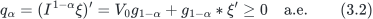

Define $`L_T`$ and $`\widehat L_T`$ from $`\nu^{-1}\int_0^T\xi(T-t)D_C^\alpha Z(t)\,dt`$ and the same expression with $`\widehat Z`$. With $`\lambda=\nu\sigma`$,

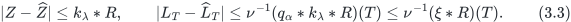

In particular, $`R/\nu\le\delta_F`$ implies

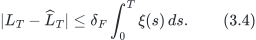

**Proof route.** Set $`e=Z-\widehat Z`$; the physical equation's divided-difference coefficient has real part at most $`-\nu\sigma`$. The AC convexity lemma applied to a smooth modulus and the positive zero-initial inverse gives the state bound, including its continuous endpoint. Absolute Fubini and AC integration by parts then express the exponent difference as $`\nu^{-1}(q_\alpha*e)(T)`$, retaining the zero state initial values and the curve term $`V_0g_{1-\alpha}`$. Positivity of $`q_\alpha`$ propagates that state bound, and $`0\le q_\alpha*k_\lambda\le\xi`$ gives the curve envelope. The argument keeps the entire fractional history and removes $`\nu^{-1}`$ only upon normalizing the physical residual by $`\nu`$; Appendix C.1–C.2 gives the full proof.

At $`\sigma=0`$, set $`k_0=g_\alpha`$; the two exponent envelopes coincide. Positive dissipation permits further reduction. The initial term $`V_0g_{1-\alpha}`$ and the factor $`\nu^{-1}`$ remain in both bounds. Stochastic admissibility of the experimental curve is verified separately in Appendix A.

For a full-history residual envelope $`R\le R_j`$ on each closed cell $`[a_j,b_j]`$, the computable cell-weight form is

Every weight integrates the history from time zero. An integration bin takes the maximum over every intersecting closed residual cell, including boundary cells. Section 7 compares curve and dissipative-kernel weights on matched inputs. Appendix C.3–C.4 proves decreasing-curve and constant-curve variants and a complementary global-state bound.

### Strict computation of the dissipative pricing kernel

The positive kernel in Theorem 3.1 admits a direct interval calculation. For $`\sigma\ge0`$, set $`\lambda=\nu\sigma`$ and

The assumptions and scaling are those of Theorem 3.1. The positive fractional inverse follows from [Kopteva2021, SimonCM2015]. We enclose the pricing-kernel weights and use them in the same actual-output certificate.

**Zero-damping special case of Theorem 3.1.** If $`\sigma=0`$,

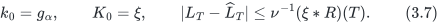

The estimate uses $`q_\alpha\ge0`$ and preserves the physical scaling at zero damping. Appendix C gives the AC regularity and comparison proofs; Appendix A treats the stochastic-model hypotheses.

For the fixed curve in (2.4), write $`A_0=\alpha_0`$ and $`\lambda_\xi`$ for its own curve parameter. On the computational domain $`\lambda T^\alpha<1`$, define

A cell $`[a_j,b_j]`$ has weight $`W_\lambda(T-a_j)-W_\lambda(T-b_j)`$. Appendix C provides the absolute series tails and interval-difference proof. The implementation uses twelve outer terms, sixty-four inner curve terms and 100-bit outward dyadic primitives. It is an enclosure of the full Mittag–Leffler kernel functional, with explicit truncation and rounding remainders; ordinary floating-point Mittag–Leffler values do not enter a guarantee.

## 4. Continuous certificates and complete Fourier prices

The reference is a fixed $`\widehat Z=I^\alpha\bar G`$, with recorded coefficients interpreted as exact dyadics. A startup power expansion and closed-cell derivative bounds certify its full physical residual. Appendix D.1 gives the construction, arithmetic and history integrals. The configuration table distinguishes the four-subcell H/Q banks from the two-subcell nearby banks. The reference is this continuous field, not the nominal nodal solver states.

The derivative-based reference exponent is $`\widehat L_T=\nu^{-1}\int_0^T\xi(T-t)\bar G(t)dt`$. Once $`\eta_n`$ encloses its exponent error, the transform disk follows by the exponential difference and the true half-shift modulus bound. A substitution-based exponent would require an additional residual-conversion term.

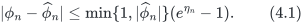

**Theorem 4.1.** Suppose $`M_T>0,\mathbb E M_T=1`$. For any $`0<a_*<1/2,h_*>0`$, let
$`g(z)=e^{-ikz}\phi_T(z-i/2)/(z^2+1/4)`$. Replacing the integral in (2.7) by the infinite trapezoidal sum incurs a price error of at most

The strip proof and the exact-solution high-frequency comparison are in Appendix D.2. A finite omitted reference value is explicitly charged, independently of the true infinite tail.

Suppose the node values $`\widehat\phi_n`$ have exact-error bounds $`\varepsilon_n`$. The finite price sum

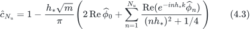

satisfies

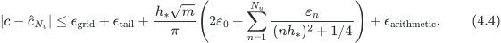

In these equations $`N_u`$ is the Fourier sum cutoff, whereas $`N_t`$ denotes time-grid cells. The origin coefficient is the trapezoidal half-weight multiplied by $`1/(1/4)`$. The exact arithmetic remainder encloses phase, square root, exponential and summation operations.

## 5. Shared errors and financial decisions

### 5.1. Joint inclusion at the frozen output

Fix one model parameter, maturity, contour, and reference grid. Let $`c^*\in\mathbb R^p`$ be the continuous-model price vector, $`\bar c`$ the exact finite reference sum, and $`c^{\rm fast}`$ the frozen rational output. For each included frequency let $`\bar\phi_n`$ be the reference transform and put $`z_n=\phi(u_n-i/2)-\bar\phi_n`$. Appendix D.1 supplies bounds $`|z_n|\le\epsilon_n`$; at a deliberately omitted finite node $`\bar\phi_n=0`$, the true-transform envelope supplies the radius. The same $`z_n`$ enters every strike at this parameter and maturity.

For the Lewis rule in Section 4, set $`m_i=K_i/F`$, $`k_i=\log m_i`$, and

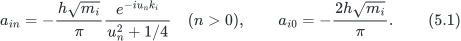

The half weight at zero is already included in $`a_{i0}`$. The complete error is

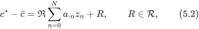

where $`\mathcal R`$ includes the true infinite-grid tail and analytic-strip discretisation error. A finite reference sum enclosed by interval arithmetic contributes its centre uncertainty when a numerical representative of $`\bar c`$ is used. Omitted finite nodes remain in (5.2); they are not also charged as an infinite tail. No stochastic covariance is used in this representation.

**Theorem 5.1 (complete shared-node inclusion).** Suppose (5.2) holds, all radii are nonnegative, and $`\mathcal R`$ is a nonempty compact convex outer set. Define

Then $`c^*-c^{\rm fast}\in d+\mathcal E_F`$, and, for real $`w`$,

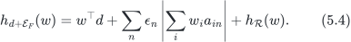

If the centre shift is supplied as a box $`d\in[d^-,d^+]`$, replace the first term by the support of that box. All numerical evaluations of (5.4) must be outward enclosures.

**Proof.** Substituting the actual transform errors in (5.2) gives inclusion. The product of complex disks is compact and convex and its real-linear image has those properties. A disk $`|z|\le\epsilon`$ has real-linear support $`\epsilon|b|`$ for the functional $`\Re(bz)`$: Cauchy--Schwarz gives the upper bound, attained at $`z=\epsilon\overline b/|b|`$ when $`b\ne0`$; when $`b=0`$, every feasible point attains it. Independent disks and Minkowski addition give (5.4). Translation gives the signed centre term. A box enclosing $`d`$ provides a further valid Minkowski outer enclosure even if its coordinates are dependent. $`\square`$

If $`\mathcal R=\prod_i[-\rho_i,\rho_i]`$, the smallest coordinate box of this same set has support

Consequently its excess over (5.4), before translation, is

It is strictly positive exactly when one positive-radius node has nonzero coefficients $`w_i a_{in}`$ that do not all lie on a common nonnegative complex ray. This follows from the equality case of the complex triangle inequality, node by node. Translation does not change widths. This criterion compares the constructed set with its own coordinate box, and does not assert strict improvement over every independently available signed price enclosure.

For any separately established signed model-price box $`\mathcal I`$, intersect it with $`\bar c+\mathcal E_F`$. The actual model vector belongs to the intersection. Without solving the intersection support problem, the minimum of the two valid directional upper bounds remains valid; likewise take the maximum of the lower bounds. Thus a computation can retain the best signed marginal information while using node cancellation where it improves the complete bound. Nonemptiness of the mathematical intersection follows from inclusion, rather than from empirical agreement between numerical approximations.

**Proposition 5.2 (nonzero omitted-node reference at an unchanged fast output).** Fix the actual fast output, including its zero contribution at omitted finite nodes. For the same finite pricing map, select a possibly nonzero reference $`\psi_n`$ at those nodes, and prove $`|\phi_n-\psi_n|\le\rho_n`$. Let $`\bar c'=c_0+\Re(A\psi)`$, $`d'=\bar c'-c^{\rm fast}`$, and let $`\mathcal R`$ include the complete strip, true infinite tail, and newly enclosed reference arithmetic. Then

For a symmetric remainder and direction $`w`$, the complete absolute budget uses

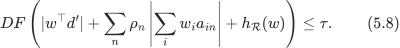

For a nonsymmetric remainder, both support directions must be bounded. A changed reference centre does not change the fixed fast output, but it does change $`d'`$ and requires new centre arithmetic.

**Proof.** Subtract and add the new finite reference in the exact finite pricing map; its transform error is $`z=\phi-\psi`$. The complete remainder contains the other discrepancies. Directional support of the shared complex disks gives (5.8). ∎

An old zero-centred certificate $`|\phi_n|\le\varepsilon_n^0`$ and a new certificate centred at $`\psi_n`$ cannot have their radii directly minimized. At the new centre, the old certificate only gives $`|\phi_n-\psi_n|\le\varepsilon_n^0+|\psi_n|`$. A safe radius is therefore $`\min\{\rho_n,\varepsilon_n^0+|\psi_n|\}`$, or one can retain the two transform disks' intersection. A new disk is nested in the old disk only if $`|\psi_n|+\rho_n\le\varepsilon_n^0`$. Otherwise, independently valid complete price intervals may still be intersected, but same-centre monotonicity is not automatic. For example, $`\phi=0`$ lies in $`D(0,.1)`$ and $`D(1,2)`$, but not in $`D(1,\min(.1,2))`$. Marginal and joint comparisons must use the same updated centre, node radii, and complete remainder. Any additional reference evaluation and certification is part of the reported cost.

### 5.2. Directional and finite-objective certificates

For $`w=e_i-e_j`$, the node coefficient is

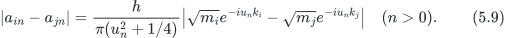

Combining the coefficients before taking their modulus preserves cancellation. With $`b_i=\sqrt{m_i}`$, an analytic bound is

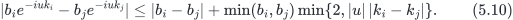

To prove it, separate the difference in amplitudes from the phase difference using the smaller amplitude, then apply $`|e^{ix}-e^{iy}|\le\min(2,|x-y|)`$. At zero, the spread coefficient is $`2h|b_i-b_j|/\pi`$. Low-frequency error therefore cancels for nearby strikes even when the individual node radii are large. High-frequency and tail contributions are still retained.

The implementation below uses rational outward bounds for logarithms, trigonometric functions, square roots, and the circle constant. It encloses the exact coefficient difference before multiplying by the saved radius. Reference-sum and frozen-output intervals supply the signed centre. Taking interval midpoints for display never substitutes for the outward endpoint arithmetic used in a decision.

If the target quote $`m^*`$ is enclosed around a stored centre $`\bar m`$ with $`m^*-\bar m\in\mathcal M`$, use $`r=c^{\rm fast}-\bar m`$ and replace the output-error set by $`\mathcal E-\mathcal M`$. This includes quote-conversion arithmetic with the correct sign. The following formulas otherwise take $`m`$ to be exact.

Let $`J(e)=(r+e)^\top W(r+e)/(2p)`$, where $`r=c^{\rm fast}-m`$, $`W\succeq0`$, and the complete output error belongs to a compact convex set $`\mathcal E`$. For any trial vector $`e_0`$, put $`g_0=W(r+e_0)/p`$. Convexity gives the certified lower bound

This follows by taking the infimum of the supporting affine function $`J(e_0)+g_0^\top(e-e_0)`$. Feasibility of $`e_0`$ is unnecessary for validity; it affects sharpness. A numerical primal minimizer becomes a lower-bound certificate only after its support or dual obligation has also been bounded correctly.

If $`M^2\ge\sup_{e\in\mathcal E}e^\top We`$, expansion yields

A safe choice is any valid coordinate box $`|e_i|\le b_i`$: with $`W`$ represented exactly, $`M^2=\sum_{ij}|W_{ij}|b_i b_j`$ is sufficient. Tighter validated norm bounds may replace it. Maximization of this convex quadratic is not certified by a local stationary point. A supporting function, norm bound, interval subdivision, or valid relaxation must establish the upper direction.

For a finite candidate collection, form valid objective intervals by intersecting (5.11)--(5.12), when used, with the original interval-square bounds in Theorem 5.3. A unique candidate is certified only if its upper endpoint is smaller than every competing lower endpoint. If this condition is absent, return the nonempty set of candidates whose lower endpoint is at most the least upper endpoint. It contains every exact minimizer. Different candidates have different transform errors; (5.4) does not identify their error variables.

The support formula, the equality case of the triangle inequality, and the convexity bounds are established tools. Their role here is to join the model-specific continuous residual certificate to the actual multi-strike pricing output, preserving every required budget and its centre. The numerical comparison in Section 7 is the evidence for the resulting financial improvement.

For Theorem 5.3 we specialize the preceding general objective to $`p=12,W=I_{12}`$ and sum exactly twelve normalized call prices, so $`J=\frac1{24}\sum_{i=1}^{12}(c_i-M_i)^2`$. Quote-conversion half-widths concern the input midpoint arithmetic and are distinct from the resulting objective half-width.

**Theorem 5.3 (finite-objective intervals and selection stability).** For each $`\alpha_j\in\Theta_{\rm finite}`$, suppose all model prices have certified enclosures

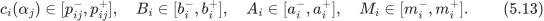

Assume $`b_i^-\le b_i^+\le a_i^-\le a_i^+`$. Define

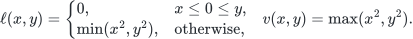

Then $`J(\alpha_j)\in[L_j,U_j]`$. Writing $`L_*=\min_jL_j,U_*=\min_jU_j`$, the exact finite-set optimum satisfies

For $`\varepsilon\ge0`$, every exact $`\varepsilon`$-near-optimal candidate belongs to

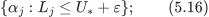

The condition $`U_j-L_*\le\varepsilon`$ is sufficient for that candidate to be near-optimal for the exact objective. If

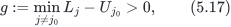

then $`\alpha_{j_0}`$ is the unique minimiser of the model objective on the finite set. If

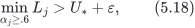

then every exact near-optimal candidate in the finite set satisfies $`\alpha_j<.6`$.

Quote consistency is checked separately. If any row satisfies $`p^+_{ij}<b_i^-`$ or $`p^-_{ij}>a_i^+`$, the candidate cannot lie in all quote bands simultaneously. Conversely, if every row satisfies $`p^-_{ij}\ge b_i^+`$ and $`p^+_{ij}\le a_i^-`$, then quote consistency is certified. Overlapping intervals without this inner-band condition retain possible consistency; overlap alone does not certify it.

The interval-square and finite-selection proof is in Appendix D.4. A continuous parameter optimum, market identification and dependence across candidate errors are outside this statement.

## 6. Structure of the specified rational output

The Gatheral–Radoicic third-order construction matches three startup and three large-time coefficients. Write $`\widehat H(y)=P(y)/Q(y)`$, $`Q=1+q_1y+q_2y^2+q_3y^3`$, with $`y=\nu t^\alpha`$. Appendix B.1 defines the raw matching matrix, determinant and numerator polynomials, proves their exact identities and gives the full sign proof. No numerical division precedes the determinant lower bound.

**Theorem 6.1 (full-frequency structure).** For

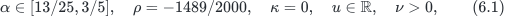

the established matching system (B.4) is nonsingular. Its normalised denominator satisfies

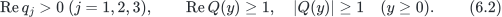

Moreover, for $`y>0`$, $`\mathop{\mathrm{Re}}\nolimits \widehat H(y)<0`$. The result holds at every positive time and every finite real frequency. Its domain is the stated parameter set; $`\alpha>.6`$, a continuous $`\rho`$ domain, and nonzero $`\kappa`$ are outside the scope of this theorem.

**Theorem 6.2 (certified correlation persistence).** The conclusions of Theorem 6.1 hold for

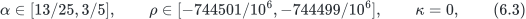

at every real Fourier frequency and every positive time.

The correlation width quantifies local persistence around the public-data parameter. Appendix B.2 gives the complete closed cover and derivative/direct fallback, with derivative bounds for the compactified quantities. Prices use the independent reference residual in Section 4.

## 7. Matched decisions and scientific controls

### 7.1. Fixed contracts, units and complete ablation

The six-month contract uses twelve strikes $`K_i=3700+100i`$, $`0\le i\le11`$, forward $`F=4221.86`$, discount $`D=1`$, and the fixed forward-variance curve (2.4). Prices and task errors are in index points, with position multiplier one. Candidate changes affect $`\alpha`$ while the curve and other parameters remain fixed. The three-candidate profile $`.52,.60,.90`$ compares this finite set; each candidate is incompatible with several market bid/ask bands. No exchange-specific currency notional is assigned.

Table 3 compares the complete $`K=4400`$ minus $`K=4500`$ task bound. Each row retains its actual output, signed centre, included finite frequencies, strip, true tail and arithmetic. Displayed upper bounds are rounded upward. The quarter-year study recomputes its maturity-specific reference integral, true-transform envelopes and tails; its upstream full-history certificate is lawfully restricted to the shorter horizon. It does not reuse a six-month exponent or tail value.

**Table 3. H0–H4 and Q0–Q2 complete unit-spread certificates, in index points; outputs and reference changes are identified by configuration.**

| Maturity and stage | Complete joint bound, points | Matched signed marginal bound, points | Interpretation |
|---|---:|---:|---|
| H0: Six months: global state propagation | 1.397612096 | — | Original failed one-point task |
| H1: Six months: finite history, same global residual | 0.378598956 | — | Principal propagation improvement; unchanged output and centre |
| H2: Six months: local envelope, original used nodes | 0.367258782 | — | About 3% further bound reduction |
| H3: Six months: all finite high nodes, global envelope | 0.132245064 | 0.158585551 | High-frequency certification and centre change are included |
| H4: Six months: all finite high nodes, local envelope | 0.115215934 | 0.137896018 | Both methods certify 0.25 points |
| Q0: Three months: through 64, global envelope | 1.207557898 | 1.545191542 | Failed 0.25-point task |
| Q1: Three months: through 128, global envelope | 0.351318692 | 0.408293698 | Failed 0.25-point task |
| Q2: Three months: through 128, local envelope | 0.233318843 | 0.252393939 | Only the joint method certifies 0.25 points |

Finite-history propagation reduces the H0 complete bound by about 72.91%. This measures a guaranteed upper bound. The six-month high-frequency refinement also changes the centre from approximately $`-0.166762218`$ to $`-0.081698202`$ points, so its reduction combines centre and uncertainty changes. In Q2, the output, centre, node radii and remainders are matched; retaining the shared errors changes the decision. The time-local quarter-year refinement was specified after the global budget failed and is an exploratory transfer experiment.

### 7.2. Twenty-eight portfolio directions

The following matched pass-count table uses H1 at each stated alpha.

Let $`e_i`$ select strike $`K_i`$. We keep the exact holdings below, without rescaling them to make a budget pass. Gross weight means $`\sum_i|w_i|`$. Every threshold is an absolute error in index points for the specified holding vector.

**Table 4. The 28 fixed portfolio directions on the twelve strikes; gross weight is the sum of absolute position weights.**

| Family | Exact direction | Count | Gross weight |
|---|---|---:|---:|
| Adjacent spreads | $`e_i-e_{i+1},\ 0\le i\le10`$ | 11 | 2 |
| Adjacent butterflies | $`e_i-2e_{i+1}+e_{i+2},\ 0\le i\le9`$ | 10 | 4 |
| Wide spreads | $`e_0-e_3,e_3-e_6,e_6-e_9,e_0-e_{11}`$ | 4 | 2 |
| Positive baskets | $`\frac1{12}\sum_{i=0}^{11}e_i,\ \frac16\sum_{i=0}^5e_i,\ \frac16\sum_{i=6}^{11}e_i`$ | 3 | 1 |

All methods in each matched comparison use identical upstream radii. At a 0.5-point budget and $`\alpha=.52`$, finite-history joint bounds certify 28/28 portfolios, compared with 13/28 signed marginal bounds. At a 0.25-point budget, the counts are 10/28 against 1/28 for $`\alpha=.60`$, and 20/28 against 13/28 for $`\alpha=.90`$. At the one-point budget for $`.52`$, both finite-history methods certify 28/28. That threshold does not distinguish the shared structure. A valid payoff intersection gives no further tightening in this setting. Failure to certify leaves the budget unresolved.

### 7.3. Prespecified nearby candidates under the original quotes

The two objective columns refer to N1 and N2 respectively.

The original twelve half-year quotes, forward F=4221.86, discount D=1,
and all other model parameters are fixed. Before computing new results we
froze alpha={0.520,0.525,0.530,0.540,0.550}, a first layer N_t=1024, and an
upgrade of **all five** candidates to N_t=2048 if any adjacent joint comparison
remained unresolved. Every point has a newly generated continuous reference
field and a complete closed-time residual bank. Fourier nodes through 64,
all omitted finite nodes through 128, true infinite tails, strip remainder,
reference arithmetic and original quote-conversion intervals are paid.

The objective is the original normalized midpoint loss
$`J=\frac1{24}\sum_i(c_i-m_i)^2`$, using normalized calls. Index-point squared units would require multiplication by $`F^2`$. Here the tiny target interval halfwidth is only
outward arithmetic error in converting the fixed bid/ask-price midpoint;
it is not the market bid/ask halfwidth. Ranking does not establish a uniform
winner for arbitrary quote targets inside those market bands.
A Taylor support enclosure preserves common
Fourier disks in its linear term and charges the full coordinate-radius
quadratic remainder. Its same-radius marginal comparison uses the identical
upstream certificate. Errors across different alpha candidates are not
assumed jointly correlated.

**Table 5. N1 and N2 five-candidate objective enclosures under the original quotes; displayed values are normalized J multiplied by 10^8.**

| alpha | N_t=1024 joint J ×10^8 | N_t=2048 joint J ×10^8 |
|---:|---:|---:|
| 0.520 | [4.825094, 6.778350] | [5.293449, 6.024095] |
| 0.525 | [5.645378, 7.501414] | [6.097920, 6.798485] |
| 0.530 | [6.748974, 8.517584] | [7.187004, 7.859529] |
| 0.540 | [9.807435, 11.422182] | [10.218707, 10.839486] |
| 0.550 | [14.000658, 15.482012] | [14.387007, 14.960680] |

**Table 6. N1 and N2 strict separations among the ten pairs of five fixed candidates, using matched joint and marginal inputs.**

| Generated layer | Joint strictly separated pairs | Matched marginal pairs |
|---|---:|---:|
| N_t=1024 | 7/10 | 3/10 |
| N_t=2048 | 10/10 | 7/10 |

The first layer retained its unresolved close pairs and triggered the frozen
all-candidate upgrade. The final finite grid has alpha=0.520 as a strict minimum.
This is a five-point comparison, not a continuous calibration optimum. All
five candidates remain incompatible with at least one original bid/ask row;
the finite-set result therefore does not identify a market-calibrated model.

The two layers generate every closed-cell residual entry: 15,754,230 entries, 5,130 reference exponents and 10,250 true-transform envelopes in total. Separate readers check complete coverage and maxima, reconstruct the exponents, coefficients and objectives, and reject deliberate corruptions. They use common rigorous primitives and the generator's residual-derivative bounds.

### 7.4. Why certify a frozen fast output?

The detailed matched output table uses N2L; the preceding failed levels are N1 and N2.

A stored-output certificate applies to pricing-library audits, historical calculations and production outputs fixed by the task. If replacement is allowed and the reference is available, returning its certified centre gives a direct control. Correcting the fast output by that centre also requires the rounding of the stored correction and final addition. The experiments compare these choices. The reference construction and verification must be included when assessing an online workload.

A separately frozen descriptive control reuses the complete $`N_t=2048,\alpha=.52`$ residual bank with 128 history bins. Every intersected closed source cell contributes to each bin maximum, and all weights are outwardly enclosed. All five methods below use the same model, six-month $`4400-4500`$ spread, 0.25-point tolerance, reference centre, node radii, strip and true-tail budget. This control does not change the prespecified nearby-grid experiment.

**Table 7. N2L actual-output controls for the half-year unit 4400–4500 spread; complete bounds and the budget are in index points.**

| Output | Complete joint, points | Matched marginal, points | Joint 0.25-point decision |
|---|---:|---:|---|
| Frozen Padé | 0.394999331 | 0.514096070 | UNRESOLVED |
| Direct reference (binary64) | 0.228237113 | 0.347333852 | PASS |
| Fast + stored correction | 0.228237113 | 0.347333852 | PASS |
| BL core, 512 steps | 0.229082759 | 0.348179497 | PASS |
| BL core, 1024 steps | 0.228534686 | 0.347631424 | PASS |

All five matched marginal bounds remain above 0.25 points. Direct reference and corrected fast values happen to have the same complete bound in this instance; their actual stored values are checked separately. Exact dyadic arithmetic charges the reference return, stored correction and final addition. For these freely replaceable outputs, the reference is simpler than delivering the unchanged fast result. The joint structure still changes the decision for the reference and BL outputs. The BL 512-to-1024 difference is a diagnostic, not its certified error.

Certificate generation encloses 2,100,735 continuous frequency-by-cell residual entries, 513 reference exponents and 1,025 true-transform node bounds, together with the infinite tail and 12,300 price coefficients. Reading checks every entry and reconstructs the exponents, coefficients and decisions. An additional portfolio needs 1,025 shared-disk support terms and the complete remainder. The 28 portfolios reuse the same bank at one parameter and maturity.

**Table 8. Typed deterministic work for the additional output constructions; these counts do not measure total computational cost.**

| Additional output construction | Deterministic mathematical work |
|---|---|
| Original Padé output | 352 Fourier values; 256 Jacobi samples per frequency |
| Direct returned reference | Return the already generated, fully charged centre with binary64 rounding |
| Corrected fast output | Store one correction and perform one binary64 addition per price |
| BL core, 512 steps | 67,371,264 history scalar-vector products; 2,626,560 transformed Riccati evaluations |
| BL core, 1024 steps | 269,222,400 history scalar-vector products; 5,253,120 transformed Riccati evaluations |

These counts measure different operations. Reference generation, outward transcendental evaluations and verification are recorded separately from nominal-output construction. The complete ledger also includes exponent quadrature and the two failed coarse-envelope stages. Actual online cost has not been measured.

### 7.5. Matched dissipative-kernel evaluation

We froze the six-month configuration at $`\alpha=13/25`$, $`\nu=2897/10000`$, $`\rho=-1489/2000`$, and $`\sigma=1489/4000`$ before computing the resolvent weights. The physical damping is therefore $`\lambda=\nu\sigma=4313633/40000000`$. All four comparisons reuse the same N2L (N_t=2048) closed-cell residual bank, the same stored binary64 fast prices, the same reference exponents and signed centres, and the same finite omission, analytic strip, true infinite tail and reference arithmetic terms. The financial direction is the unit 4400–4500 call spread; the full finite grid contains 1025 frequencies, including 513 used reference frequencies and 512 retained finite omitted frequencies. The complete twelve-price certificate is reconstructed for every method.

For N2L, the dimensionless damping is $`\lambda T^\alpha\approx0.075205`$ (about 0.075205153821). Dissipation is weak over this horizon, consistent with the modest kernel gain. The complete budget also contains the fixed centre, finite omitted nodes and other remainders.

Table 9 reports upper endpoints in index points, rounded upward to nine decimals. “Global state” first bounds the state by its global residual and then applies the exponent functional; “global curve” propagates that same residual maximum directly through the curve. The final two rows use the identical 128 binwise envelopes and differ only in the pricing kernel.

**Table 9. N2L matched propagation for the half-year unit 4400–4500 spread, in index points; the residual bank and all other inputs are fixed.**

| Propagation | Frozen fast marginal | Frozen fast joint | Stored reference joint | Used-node joint radius |
| --- | ---: | ---: | ---: | ---: |
| Global state | 3.690877564 | 1.829428107 | 1.662665889 | 1.476801373 |
| Global curve | 0.589267065 | 0.428570987 | 0.261808769 | 0.075944253 |
| Local curve | 0.514096070 | 0.394999331 | 0.228237113 | 0.042372598 |
| Local dissipative resolvent | 0.509733613 | 0.393082828 | 0.226320610 | 0.040456094 |

The binary64 corrected-fast output has the same certified bounds as the stored reference in this configuration, including conversion and rounding. The exact rational reduction from local curve to local resolvent is positive and approximately 0.001916504 points: about 0.485% of the complete frozen-fast bound and 4.523% of its used-node joint radius. These percentages compare upper bounds. The one-point and half-point frozen-output tasks pass; the quarter-point task remains unresolved. Both local methods certify the stored reference and corrected output at a quarter point, so dissipation does not change that decision.

The fixed terms limit further reduction. Even if all 513 used reference-node contributions vanished, the same symmetric budget would retain the absolute centre, finite omitted-node radius and other remainders. Their exact rational sum is strictly greater than the downward decimal endpoint 0.352626733 points. This lower limit belongs to the stated budget formula. With those terms fixed, refining used nodes alone cannot certify a quarter point; the omitted finite frequencies and reference centre must also be addressed.

The reconstructed global-curve and local-curve endpoints agree exactly with the saved baseline rational endpoints, including all twelve individual radii and frozen-output bounds; the table displays strict nine-decimal upward endpoints.

### Verification scope and mathematical work

The separate reader actually reads all 2,100,735 entries of the complete residual bank, checks closed-cell coverage from zero, and recomputes the maxima for all 128 propagation bins. It independently expands the cumulative resolvent by the direct double Gamma series with fourteen outer terms, while the producer uses twelve outer terms and a strict power-field moment. Both enclose all inner tails with sixty-four retained terms. The reader checks all 513 transform-radius minima in all four comparisons and rebuilds all twelve prices with all 1025 finite frequencies. At $`\sigma=0`$, it replays all 129 cumulative endpoints and all 128 cell weights against the curve-kernel conclusion. Eight actual negative controls are rejected: negative damping, an incorrect physical $`\nu`$ scale, a missing initial closed cell, a removed finite omitted node, an erased true infinite tail, an altered signed centre, an understated resolvent exponent enclosure, and a zero-damping weight that does not reproduce the curve kernel.

The reader reconstructs the cumulative-weight algebra and certificate assembly. It shares the dyadic arithmetic, Gamma, logarithm and exponential primitives, together with the validated residual-derivative bounds and reference exponents. The execution receipts record these dependencies.

This propagation reuses the residual bank. The weighted sum contains $`513\times128=65,664`$ terms and 129 cumulative endpoint enclosures, with twelve outer series terms per producer endpoint and sixty-four inner curve terms. These counts describe that calculation; workloads that generate residuals or reference prices perform additional work. The kernel evidence component contains the fixed contract, interval outputs and separate reader.

### 7.6. Matched ledgers and certificate resolution

The quarter-maturity decision is attributable to shared aggregation. Q2 uses identical actual output, reference centre, 1025 node radii and all remainders in both columns. Finite omitted-node support is zero because every finite node has a nonzero reference. Values below are in index points; exact fractions are retained in quarter-exact-ledger.json.

**Table 10. Q2 quarter-year unit-spread ledger, in index points; only aggregation of the shared node errors differs between columns.**

| Component | Joint | Signed marginal |
| --- | --- | --- |
| Signed centre | -0.149775146827 | -0.149775146827 |
| Absolute centre charge | 0.149775146827 | 0.149775146827 |
| Used-node support | 0.045461793432 | 0.064536889507 |
| Finite omitted-node support | 0.000000000000 | 0.000000000000 |
| Strip remainder | 0.000026654230 | 0.000026654230 |
| True infinite-tail remainder | 0.038055248032 | 0.038055248032 |
| Reference arithmetic | 4.148871871727e-16 | 4.148871871727e-16 |
| Complete upper bound | 0.233318843 | 0.252393939 |

The joint complete bound is 0.233318843 points versus 0.252393939 points for signed marginal aggregation; only the joint certificate passes the 0.25-point budget. The difference 0.019075095 points is entirely the node-support aggregation difference. Complete-bound displays are rounded upward to nine decimal places; component/centre and gap displays are approximate. Every decision and ledger identity uses exact fractional endpoints. Tiny reference arithmetic is displayed separately, and the signed centre is a locator, not an extra additive charge on top of its absolute value.

Every portfolio curve uses the 28 originally fixed and fully specified directions. Exact endpoints, all threshold breakpoints and pass counts are supplied in portfolio-exact-thresholds.csv and portfolio-budget-counts.json. Certification uses the complete rational endpoint condition $`B\leq\tau`$, including equality. Between-bank plots show descriptive changes; joint versus signed marginal within one bank uses matched radii. No 28-direction quarterly dataset is inferred from the single quarter spread.

**Table 11. Complete-budget pass counts for all 28 fixed half-year directions; budgets are in index points and equality is included.**

| Bank | alpha | Budget points | Marginal | Joint |
| --- | --- | --- | --- | --- |
| H0 | 13/25 | 1/4 | 0/28 | 0/28 |
| H0 | 13/25 | 1/2 | 0/28 | 0/28 |
| H0 | 13/25 | 1 | 0/28 | 3/28 |
| H1 | 13/25 | 1/4 | 0/28 | 2/28 |
| H1 | 13/25 | 1/2 | 13/28 | 28/28 |
| H1 | 13/25 | 1 | 28/28 | 28/28 |
| H1 | 3/5 | 1/4 | 1/28 | 10/28 |
| H1 | 3/5 | 1/2 | 22/28 | 28/28 |
| H1 | 3/5 | 1 | 28/28 | 28/28 |
| H1 | 9/10 | 1/4 | 13/28 | 20/28 |
| H1 | 9/10 | 1/2 | 25/28 | 25/28 |
| H1 | 9/10 | 1 | 27/28 | 28/28 |
| N1 | 13/25 | 1/4 | 0/28 | 0/28 |
| N1 | 13/25 | 1/2 | 0/28 | 4/28 |
| N1 | 13/25 | 1 | 15/28 | 28/28 |
| N2 | 13/25 | 1/4 | 0/28 | 0/28 |
| N2 | 13/25 | 1/2 | 6/28 | 23/28 |
| N2 | 13/25 | 1 | 28/28 | 28/28 |
| N2L | 13/25 | 1/4 | 0/28 | 1/28 |
| N2L | 13/25 | 1/2 | 11/28 | 26/28 |
| N2L | 13/25 | 1 | 28/28 | 28/28 |

The two nearby levels retain all ten unordered pairs, including unresolved ones:

**Table 12. Complete unresolved-pair lists for N1 and N2 under the original quotes, alongside strict separation counts.**

| N_t | Method | Separated pairs | Complete unresolved list |
| --- | --- | --- | --- |
| 1024 | joint | 7/10 | (0.520, 0.525), (0.520, 0.530), (0.525, 0.530) |
| 1024 | marginal | 3/10 | (0.520, 0.525), (0.520, 0.530), (0.520, 0.540), (0.525, 0.530), (0.525, 0.540), (0.530, 0.540), (0.540, 0.550) |
| 2048 | joint | 10/10 | none |
| 2048 | marginal | 7/10 | (0.520, 0.525), (0.520, 0.530), (0.525, 0.530) |

The closest N2 joint separation, alpha=.520 versus .525, is a positive gap of approximately 7.382643478687e-10 in normalized squared-midpoint loss. Its endpoint identity is $`J_{0, B}-J_{0, A}-H_B-H_A-Q_A`$ plus any box-intersection endpoint adjustment. The gap decomposition, including used nodes, finite zero nodes, reference strip/tail/arithmetic and midpoint-conversion arithmetic, is recorded exactly in nearby-pair-resolution.json. This is a fixed original midpoint-loss ranking. The midpoint-conversion arithmetic interval does not represent the market bid/ask width; all five candidates remain separately bid/ask-incompatible.

The unchanged actual half-year 4400–4500 output admits the following complete centre accounting. Signed centres are approximate displays; radius and complete-bound columns are decimal upper endpoints, so independently rounded columns need not add exactly:

**Table 13. Half-year frozen-output centre accounting for H2–H4, N2 and N2L, in index points; upper-endpoint rounding is applied independently.**

| Bank | Signed centre points | Complete radius points | Complete bound points |
| --- | --- | --- | --- |
| H2 | -0.166762218 | 0.200496564 | 0.367258782 |
| H3 | -0.081698202 | 0.050546863 | 0.132245064 |
| H4 | -0.081698202 | 0.033517732 | 0.115215934 |
| N2 | -0.166762218 | 0.261808769 | 0.428570987 |
| N2L | -0.166762218 | 0.228237113 | 0.394999331 |

Expanding H2 to H3 changes the absolute centre charge as well as the paid reference radius; H3 to H4 retains that new centre. N2 to N2L retains its own reference centre and full remainders. H4 to N2L is a descriptive cross-bank identity, not an ablation. These transitions are exact in frozen-output-centre-account.json, which also reports the common strict-reference certificate floor as a fraction of each BL-core bound. A dominant floor limits what this comparison can establish about intrinsic solver accuracy. When replacement is permitted and the strict reference is already available, returning that reference directly is the simpler workload; frozen-output audit and free replacement answer different tasks.

### 7.7. Scope of the experiments

The modern-method comparison reimplements the modified-Adams Riccati core described by Boyarchenko et al.; it does not reproduce their full SINH deformation or Conformal Bootstrap. Agreement between two discretizations is a numerical diagnostic, not an interval certificate. Any comparison to a complete certified output must pay the independent reference, tails, arithmetic and verification costs required by that guarantee.

The fixed refinement menu terminates reliably when the complete task radius meets the budget. Minimum action count assumes that all alternative radii have been certified and each action has unit cost. Constructing those alternatives is part of certificate generation. Model fit, market uncertainty, transaction costs and continuous calibration require additional analysis.

## 8. Scope and reproducibility

The certificate uses the stated model, affine transform, regular reference and outward enclosures. Appendix A establishes stochastic admissibility for the experimental curve. The structural theorem covers its narrow parameter domain. Unresolved intervals, failed budgets and quote incompatibilities are reported alongside successful certificates.

The [online paper](https://github.com/130U/certified-rough-heston-valuation/blob/paper/ARTICLE.md), scientific source and verification procedures are available in this repository. The complete numerical banks are retained in the author's local evidence archive. `python reproduce.py --full` requires those banks; the public checkout alone does not provide a complete saved-bank replay. The source is under `science/`, and `python verify_source.py` checks the published source hashes.

Tables E.6, E.7 and E.10 list the generation commands, reading commands, recomputation scope and shared dependencies. `--full` reads the specified banks, reconstructs downstream prices and objectives, and additionally checks the original structural cover. Continuous residual regeneration has separate commands. Saved derivative bounds and common rigorous primitives remain inputs to the readers. The reported acceptance runs were performed by the author.

The supplement records software dependencies, evidence volume and mathematical work counts. Closed cells, interval terms, history products and support terms count different operations. At a fixed parameter and maturity, further directions reuse one certified bank; generating that bank remains part of the complete task.

Appendices A–E contain the main proofs and experiments. Appendices F–G give classical Heston common-state inclusion and the four-part identity for inexact trial functions. Their terminal certificate and thirteen-dimensional diagnostic do not supply the full coefficient bank needed for annual monetary pricing.

The construction certifies stored outputs and reuses a common Fourier bank across financial directions. If output replacement is allowed and a certified reference is available, returning the reference is a direct alternative. A comparison with true solver error requires a rigorous error interval; when that interval crosses zero, no finite upper ratio of certificate width to true error is reported.

## Appendix A. Probability model and strip transform

We use Abi Jaber–El Euch, arXiv:1803.00477, first posted on 2018-03-01, with a PDF title-page date of March 2, 2018. The journal article appeared in 2019 in Statistics & Probability Letters 149, 63–72. Locators below refer to the 13-page preprint: Theorem 2.1 and Example 2.2 on p.4, Theorem 2.3 on p.5, and H2 and Table 1 on pp.9–10.

For $`K_\alpha=t^{\alpha-1}/\Gamma(\alpha)`$,

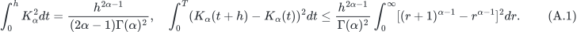

The exponent in the latter integral is $`2\alpha-2>-1`$ at zero and $`2\alpha-4<-1`$ at infinity, so the integral is finite. The resolvent of the first kind,

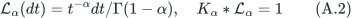

is verified by the Beta identity and is nonnegative and nonincreasing. The completely monotone spectral measure

gives $`K_\alpha(t)=\int e^{-xt}\mu_\alpha(dx)`$. Under $`r=xh`$, the two spectral integrals in H2 become constants times $`h^{\alpha-1}`$ and $`h^{\alpha-1/2}`$, respectively. The remaining constants
$`\int(1\wedge r^{-1/2})r^{-\alpha}dr`$ and
$`\int r^{-\alpha-1/2}(1\wedge r)dr`$ are finite for $`.5<\alpha<1`$. Table 1 of the source therefore covers the required shifted-kernel conditions.

Curve (2.4) is nondecreasing, has a nonnegative initial value, and is locally Hölder with exponent $`\alpha_0=.5286`$. On $`\alpha\in[.52,.9]`$, the kernel has $`\gamma/2=\alpha-.5\le.4<\alpha_0`$. Hence the curve-class assumptions in Example 2.2(i) hold, and Theorem 2.1 gives a nonnegative continuous weak variance solution and moment bounds. The equivalent kernel input is

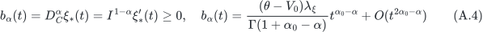

Its worst exponent is $`-.3714>-.5`$, so it belongs to $`L^2_{\rm loc}`$; also $`\xi_*=V_0+K_\alpha*b_\alpha`$. The nonnegative input measure meets Example 2.2(ii). This verifies the model specification with a varying kernel and fixed forward variance curve.

Theorem 2.3 of the source requires $`\mathop{\mathrm{Re}}\nolimits \psi_1\in[0,1]`$, a second-state initial transform with nonpositive real part, and a variance forcing term with nonpositive real part. Taking $`\psi_1=ia=1/2+iu`$ and zero for the other initial and forcing terms gives (2.2), (2.6), and uniqueness in weak law. With $`\psi_1=1`$, the Riccati solution is zero and $`\mathbb E S_T=S_0`$ follows. A positive local martingale with constant expectation is a true martingale. Thus the probability strip in (4.2) follows from the continuous-time model. This argument applies established existence and affine-transform theory.

## Appendix B. Exact construction and structural certificates

### B.1. Matching algebra and full-frequency proof

Set $`S=s_0-i\rho u=-d`$, take the principal square root in $`A=\sqrt{S^2+2b}`$, and let $`R=A-S`$. The three short-time and long-time coefficients are respectively

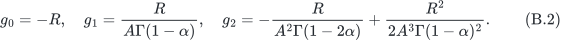

For $`1/2<\alpha<1`$, $`\Gamma(1-2\alpha)`$ is finite and negative. The fixed two-endpoint construction of Gatheral and Radoičić [GR2019] requires

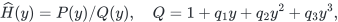

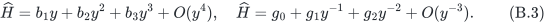

These six conditions give the linear system

Equations (B.1)–(B.4) are the established construction. We next prove invertibility, a nonvanishing denominator, the trajectory half-plane property, and exact-solution error bounds for an independent reference trajectory.

To avoid division by the matching determinant before proving its nonvanishing, define

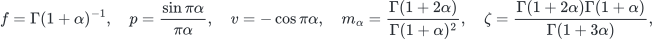

The reflection formula and recurrence relations give $`b_1=-fb,b_2=f^2\mathsf M_2,b_3=f^3\mathsf c`$ and $`g_1=V/f,g_2=W/f^2`$. In the latter two expressions, the factors $`f,f^2`$ occur in the denominators. Direct expansion of the determinant and Cramer numerators of (B.4) gives

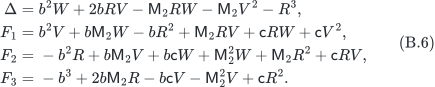

Here $`\Delta`$ is exactly the determinant of the original system, and the numerators are $`N_j=f^jF_j`$. After establishing $`\Delta\ne0`$, we may define $`q_j=N_j/\Delta`$, in which case

In physical time, the denominator coefficients are $`\nu^jq_j`$; the normalised coefficients $`q_j`$ retain their original definition.

**Proof.** First take $`u\ge0`$. Set

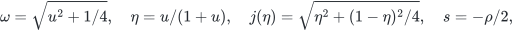

Since $`j^2\ge1/5`$, these functions are defined on the closed interval $`\eta\in[0,1]`$. We have $`|\bar S|=|\rho|`$ and

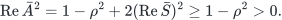

The principal square root is continuous and lies in the first quadrant; $`\mathop{\mathrm{Re}}\nolimits \bar A,|\bar A|>3/5`$. The real part of the Hermitian product of two first-quadrant numbers is nonnegative. Hence

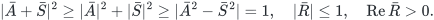

Equation (B.8) expresses $`\bar A-\bar S`$ in reciprocal form, with a denominator determined directly by the current parameters.

Substitute $`\bar b=1/2`$ and (B.8) into (B.5)–(B.6) to obtain the barred original quantities. Homogeneity gives

Define three real functions

The rigorous rational covering in Appendix B proves that, throughout the closed rectangle $`[13/25,3/5]\times[0,1]`$, $`\bar B_j>0`$ and

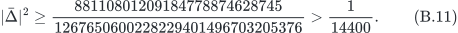

This first establishes $`\Delta\ne0`$ and then yields
$`\mathop{\mathrm{Re}}\nolimits q_j=(f\omega)^j\bar B_j/|\bar\Delta|^2>0`$, proving (6.2).

For the trajectory half-plane, the finite convolution in (B.7) gives

The same rational covering certifies the six compactified quantities $`\bar D_n<0`$, with scaling $`D_n=\omega^{7+n}\bar D_n`$. Set $`z=f\omega y`$. The right-hand side of (B.12) is
$`\omega^7\sum_{n=1}^6\bar D_nz^n`$ and is therefore strictly negative for every $`y>0`$. Having proved that the denominator is nonzero, division by $`|Q|^2|\Delta|^2`$ gives $`\mathop{\mathrm{Re}}\nolimits \widehat H<0`$. Negative frequencies follow by conjugate symmetry of the principal root and matching coefficients. The closed endpoint $`\eta=1`$ represents the infinite-frequency limit, so the proof on the closed compactified domain covers every finite frequency. ∎

Positive real parts of the coefficients provide a sufficient condition for a nonvanishing denominator. Appendix B specifies the algebraic identities, elementary-function remainder bounds, and continuous interval covering used in the computer-assisted proof.

### A continuous, quantitatively bounded correlation extension

The domain contains the public-data correlation and roughness candidates for the fixed six-condition construction. Its sign cover includes a continuous roughness interval and all frequencies. Strict signs imply persistence in correlation; the following bounds quantify that local persistence.

The certificate domain is $`\mathcal B=[13/25,3/5]\times[0,1]`$. Every interval $`I=[\ell/2^{100},r/2^{100}]`$ uses integer outward rounding. Rational inputs are rounded down and up; products take extrema over the four endpoint corners and are quantised. Reciprocals first exclude zero. Square roots use integer isqrt and an increment for the upper endpoint. Complex quantities use rectangular real–imaginary interval arithmetic. The analytic lower bounds in (B.8) fix the principal-root and reciprocal branches; no floating-point sign tolerance is used.

The four basic $`\alpha`$-dependent functions $`p,v,m_\alpha,\zeta`$ satisfy

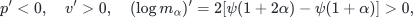

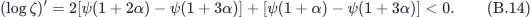

We have $`\psi'(x)=\sum_{n\ge0}(x+n)^{-2}>0`$, and elementary trigonometric identities give the derivatives of $`p,v`$. Strict endpoint values therefore enclose each continuous $`\alpha`$ interval, without sampling $`\alpha`$ at grid points.

The constant $`\pi`$ is certified by Machin's identity and one hundred terms of each alternating arctangent series. The logarithm is reduced to $`[1,2]`$ and evaluated with one hundred positive atanh-series terms and a geometric tail. The exponential is reduced to $`[0,1]`$, evaluated with one hundred Taylor terms and a geometric tail, and restored by repeated rigorous squaring. For positive real Gamma arguments, recurrence first shifts to $`z\ge20`$. Retaining $`B_2,\ldots,B_{20}`$ in log Gamma gives the positive-real remainder bound

In Binet's positive integral, the ten-term geometric remainder of arctangent is positive and bounded by the first omitted power. Integration gives (B.15), consistent with the positive-real Stirling remainder in NIST2010. After exponentiation, divide successively by the recurrence factors. Sine and cosine retain thirty-two terms, with absolute Lagrange tails $`M^{65}/65!,M^{64}/64!`$. Bernoulli numbers, factorials, and interval endpoints are exact rationals.

For each closed rectangle, substitute these enclosures successively into (B.8), (B.5), (B.6), (B.10), and (B.13). Accept only when the lower endpoints of all three $`\bar B_j`$ are strictly positive and the upper endpoints of all six $`\bar D_n`$ are strictly negative. Otherwise bisect one coordinate at its exact rational midpoint. The two closed children have the parent rectangle as their union, and strict enclosures also cover the shared boundary.

The finite covering contains 211241 leaf rectangles of total rational area exactly $`2/25`$. An independent check reconstructs 422481 binary-tree nodes from the root, with maximum depth 19 and each recorded leaf occurring exactly once. In addition to the area check, this excludes missing subtrees, interior overlap, and endpoint gaps. The theorem uses the order interval covered by this complete closed tree.

The stronger rational margins in the complete certificate imply the following bounds. Each simplification has been independently checked using Fraction.

**Table B.1. Strict lower bounds on the full compactified structural domain specified in Appendix B.**

| Quantity on the full compactified domain | Strict lower bound |
|---|---:|
| $`\bar B_1,\bar B_2,\bar B_3`$ | $`1/6000,\ 1/8000,\ 1/20000000000`$ |
| $`-\bar D_1,-\bar D_2,-\bar D_3`$ | $`1/30000,\ 1/2000000000,\ 1/6000`$ |
| $`-\bar D_4,-\bar D_5,-\bar D_6`$ | $`1/8000,\ 1/15000000,\ 1/100000`$ |
| $`\lvert\bar\Delta\rvert^2`$ | $`1/14400`$ |

The proof consists of rigorous interval inclusion and a complete finite covering. The supplementary material provides the interval implementation, all leaf rectangles, and the tree-structure check for independent verification.

### B.2. Continuous correlation persistence

**Proof.** Retain the frequency compactification $`\eta=u/(1+u)`$, $`0\le\eta\le1`$, and the original unnormalized polynomials $`\Delta,F_j,B_j,D_j`$. Write $`S_b=-\rho[(1-\eta)+2i\eta]/(2h)`$, $`h^2=\eta^2+(1-\eta)^2/4`$. Then $`|S_b|=|\rho|`$, $`\Re S_b\ge0`$ for negative $`\rho`$, $`A^2=1+S_b^2`$, and $`R=(A+S_b)^{-1}=A-S_b`$. Throughout $`|\rho|\le3/4`$, the square-root branch remains fixed because $`\Re A^2\ge1-\rho^2>0`$. Consequently,

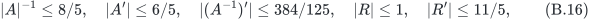

where primes denote real $`\rho`$ derivatives. The identity $`|R|\le1`$ follows from $`|A+S_b|^2\ge1`$: the terms $`\Re A\,\Re S_b`$ and $`\Im A\,\Im S_b`$ are nonnegative, while $`|A|^2=|1+S_b^2|\ge1-|S_b|^2`$. Also $`\Re R>0`$, since $`(\Re A)^2-(\Re S_b)^2=(|1+S_b^2|+1-|S_b|^2)/2>0`$.

For the $`\alpha`$-dependent scalars of Theorem 6.1, exact outward endpoint enclosures give

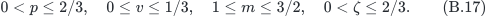

Here $`p`$ decreases and $`v,m`$ increase on the stated interval, while $`\zeta`$ decreases. The gamma-ratio assertions follow from the increasing digamma function; $`m\ge1`$ also follows from log convexity of $`\Gamma`$. None depends on $`\rho`$.

Apply product-rule modulus bounds to the original polynomial formulas. For every $`(\alpha,\eta)`$, the resulting exact rational constants $`L_{B,j},L_{D,j}`$ satisfy

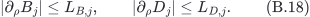

They are assembled using pairs $`(M,N)`$, meaning $`|f|\le M`$, $`|f'|\le N`$, with addition $`(M_1+M_2,N_1+N_2)`$ and multiplication $`(M_1M_2,N_1M_2+M_1N_2)`$. This yields a finite, directly checkable rational derivation rather than a numerical derivative estimate.

Let $`m_{B,j}(C),m_{D,j}(C)`$ be the exact original sign lower bounds on a continuous $`(\alpha,\eta)`$ cell $`C`$ at $`\rho_0=-1489/2000`$. A cell is certified throughout the target correlation interval whenever all bounds

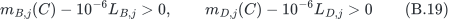

hold. The mean-value theorem proves this sufficient test; it uses a derivative enclosure, not numerical differentiation. It certifies 182002 original leaves and 79758 finer leaves. For the remaining cells, directly evaluate the original complex polynomial formulas with $`\rho`$, $`\alpha`$ and $`\eta`$ all interval valued. Exact outward dyadic arithmetic certifies strict $`B_j>0`$ and $`D_j<0`$ on 19808 additional closed cells.

The original complete midpoint tree and the exact local splice trees verify that these 281568 cells cover the entire $`(\alpha,\eta)`$ rectangle without gaps or interior overlap. Their exact area is $`2/25`$; each cell carries the entire correlation interval, giving exact three-dimensional volume $`1/6250000`$. Hence the raw signs hold for every point of the stated domain. In particular $`\Delta\ne0`$, the normalized denominator coefficients have positive real part, and all real numerator coefficients of the half-plane test are negative. The original algebraic implication gives (6.3), including $`\eta=1`$, the infinite-frequency limit. Conjugacy supplies negative frequencies. ∎

This is a narrow local robustness result: the total correlation width is $`2\times10^{-6}`$. It does not establish a typical broad calibration box or a new price experiment at an altered correlation. The direct interval supplement is explicitly exploratory: its protocol was frozen after the derivative-only attempt left positive unresolved area. The evidence retains that partial result and the separately valid conservative fallback.

The independent reader checks every saved original sign, the original 422481-node partition tree, the local splice geometry, the independently assembled derivative majorants and all 19808 direct cells through separate Cramer matrices and numerator-polynomial convolution. The dyadic primitives and saved original sign generation remain shared dependencies; every old interval-polynomial evaluation is not regenerated. Exact large fractions stay in the machine ledger. Neither a sampled correlation grid nor an assertion of continuity replaces any cell in this proof.

## Appendix C. Complete propagation proofs and analytic variants

### C.1. Regularity, convexity and dissipative state comparison

If $`H=I^\alpha F(H)`$ is a bounded local continuous solution, then $`H,F(H)`$ are $`\alpha`$-Hölder continuous. For $`\alpha>1/2`$, write $`q=F(H)`$. Cancellation gives the derivative formula

The bound 

is integrable at zero. Positive-time continuity and the limit from truncated intervals establish absolute continuity on the closed interval. The near-endpoint exponent satisfies $`2\alpha-2>-1`$; the other endpoint and the first term are integrable. Thus $`H\in AC`$ and it is locally $`C^1`$ at positive times. Local existence follows from Volterra contraction on a bounded ball. For $`v\in AC`$ that is locally Lipschitz at positive times, integration by parts gives

At a positive maximum over the full history, with zero initial value, this derivative is strictly positive. Consequently, $`D_C^\alpha v+s v\le D_C^\alpha w+s w`$, $`v(0)=w(0)`$, and $`s\ge0`$ imply $`v\le w`$. For a convex $`C^1`$ function $`\Phi`$ on the real plane, apply the supporting-hyperplane inequality to both terms in (C.3) to obtain

This Caputo history-convexity inequality follows from the supporting-hyperplane inequality. Under the regularity assumptions of Proposition 3.11 of Li and Liu [LiLiu2018], we prove the form needed below.

**Lemma C.1.** Suppose $`\alpha\in(1/2,1),|\rho|\le1,s_0\ge0`$. The normalised equation has a unique global solution, and $`\mathop{\mathrm{Re}}\nolimits H(x)<0`$ for $`x>0`$. If $`s_0>0`$, then

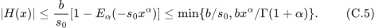

When $`s_0=0`$, the latter time-dependent bound remains valid.

**Proof.** Write $`H=X+iY`$. Completing the square gives

If $`X`$ first reaches a small positive level $`\varepsilon<1/2`$, the derivative in (C.3) is positive, whereas (C.6) is negative, a contradiction. Thus $`X\le0`$. Reaching zero at a positive time gives the same contradiction, proving strict negativity.

Let $`\psi_\epsilon(z)=\sqrt{|z|^2+\epsilon^2}-\epsilon`$. Equation (C.4), together with

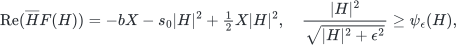

gives $`D_C^\alpha\psi_\epsilon(H)+s_0\psi_\epsilon(H)\le b`$. Compare with the zero-initial-value linear scalar equation and let $`\epsilon\downarrow0`$ to obtain (C.5). The scalar solution is verified directly by the Mittag–Leffler series. If finite-time blow-up occurred, (C.5) would bound the trajectory, $`F(H)`$, and a uniform Hölder constant. The history integral would have a finite limit at that endpoint, and local contraction with the previously accumulated history as forcing would extend the solution, a contradiction. The Caputo history is not restarted. Successive Volterra contractions give uniqueness. ∎

**Theorem C.2 (dissipative residual bound).** Suppose $`s_0>0`$, $`\widehat H(0)=0`$, and $`\widehat H\in AC`$, with local Lipschitz regularity at positive times. Assume, for every $`x\in(0,X]`$, that

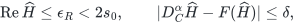

Set $`\sigma=s_0-\epsilon_R/2>0`$. Then

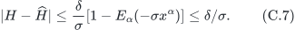

In particular, for a trajectory in the left half-plane, one may take $`\epsilon_R=0,\sigma=s_0`$. No smallness assumption on $`\delta`$ or $`u`$ is required.

**Proof.** The error $`e=H-\widehat H`$ satisfies

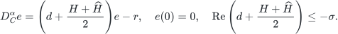

Apply (C.4) to $`\psi_\epsilon(e)`$ to obtain
$`D_C^\alpha\psi_\epsilon(e)+\sigma\psi_\epsilon(e)\le|r|\le\delta`$.
Comparison with the linear scalar solution, followed by $`\epsilon\downarrow0`$, proves the claim. Convex regularisation includes points of zero error and applies to the complex error viewed as a vector in the real plane. ∎

If $`\widehat H`$ corresponds to the physical-time trajectory $`\widehat Z`$ and $`|r_t|/\nu\le\delta_F`$ has been certified, the same result gives

In the numerical example, $`s_0=1489/4000`$. This dissipation rate controls the complex error modulus; Appendix D.1 supplies the independent residual $`\delta_F`$. The estimate applies the established convexity tool to the specific error propagation considered here.

Li and Liu [LiLiu2018, Proposition 3.11(ii)] give Caputo convexity by regularization and a distributional limit; their Proposition 4.12 treats specified vector gradient and Hamiltonian flows. Kopteva [Kopteva2021, Lemma 2.8 and Theorem 2.2] uses norm convexity and a positive fractional inverse under positive-time Lipschitz hypotheses. The following lemma proves the vector $`AC`$ form needed here, including the terminal-time conclusion.

**Regularity lemma (AC convexity and the continuous endpoint).** Let $`0<\alpha<1`$, $`T>0`$, $`v\in AC([0,T];\mathbb R^d)`$, and let $`\Phi\in C^1(\mathbb R^d)`$ be convex. With $`D_C^\alpha v=g_{1-\alpha}*v'`$,

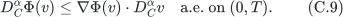

Let $`u\in AC[0,T]`$, $`u(0)=0`$, $`\lambda\ge0`$, and $`R\in L^\infty(0,T)`$ be nonnegative. If $`D_C^\alpha u+\lambda u\le R`$ almost everywhere, then

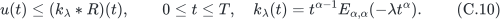

**Proof.** Choose smooth $`f_n\to v'`$ in $`L^1(0,T)`$, and set $`v_n(t)=v(0)+\int_0^t f_n(s)\,ds`$. Then $`v_n(0)=v(0)`$, $`v_n\to v`$ uniformly, and $`v_n'\to v'`$ in $`L^1`$. For a smooth path, integration by parts expresses the difference between the two sides of (C.9) as

where $`B_\Phi(a,b)=\Phi(a)-\Phi(b)-\nabla\Phi(b)\cdot(a-b)\ge0`$. Smooth paths are locally Lipschitz. A gradient bound $`M`$ on the compact path range and a local path Lipschitz constant $`L`$ give $`B_\Phi(v_n(s),v_n(t))\le2ML|t-s|`$. The endpoint kernel $`(t-s)^{-\alpha}`$ is therefore integrable. The supporting-hyperplane inequality may first be integrated with history truncated at $`t-\delta`$, and the classical Caputo integrals converge as $`\delta\downarrow0`$.

All path ranges lie in one compact set. Continuity of $`\nabla\Phi`$ and the ordinary $`AC`$ composition rule give

The same convolution estimate applies to $`\Phi(v_n)-\Phi(v)`$. Moreover, the products $`\nabla\Phi(v_n)\cdot D_C^\alpha v_n`$ converge in $`L^1`$ to the corresponding product for $`v`$. Passing to an almost-everywhere convergent subsequence proves (C.9). This uses the ordinary composition rule only for the first derivative inside $`AC`$; no Caputo chain rule is asserted.

For (C.10), put $`f=D_C^\alpha u+\lambda u\in L^1(0,T)`$. The zero initial value gives $`u+\lambda g_\alpha*u=g_\alpha*f`$. The locally convergent resolvent series, whose $`n`$-th term has $`L^1(0,T)`$ norm bounded by $`\lambda^{n-1}T^{n\alpha}/\Gamma(1+n\alpha)`$, gives $`u=k_\lambda*f`$ almost everywhere. Complete monotonicity of $`E_{\alpha,\alpha}(-x)`$ [SimonCM2015] supplies $`k_\lambda\ge0`$, so $`f\le R`$ implies $`u\le k_\lambda*R`$ almost everywhere. The convolution on the right is continuous: extend $`k_\lambda`$ and $`R`$ by zero, and use $`L^1`$ translation continuity of the kernel with the $`L^\infty`$ bound on $`R`$. Its value at zero is zero. Since $`u`$ is continuous, an almost-everywhere inequality extends to every point of $`[0,T]`$, including maturity. ∎

### C.2. Proof of Theorem 3.1

**Proof.** For $`e=Z-\widehat Z`$, the divided difference gives $`D_C^\alpha e=\nu[d+(Z+\widehat Z)/2]e-r`$, with coefficient real part at most $`-\lambda`$. Apply the regularity lemma to $`v_\varepsilon=(|e|^2+\varepsilon^2)^{1/2}-\varepsilon`$. Since $`\nabla v_\varepsilon\cdot e=|e|^2/(|e|^2+\varepsilon^2)^{1/2}\ge v_\varepsilon`$ and $`|\nabla v_\varepsilon|\le1`$,

Equation (C.10) and the limit $`\varepsilon\downarrow0`$ yield the first state inequality at every time. Absolute Fubini gives $`I^{1-\alpha}\xi=V_0g_{2-\alpha}+g_{2-\alpha}*\xi'`$, whose derivative is (3.2), and $`g_\alpha*q_\alpha=\xi`$. In particular, $`q_\alpha\in L^1`$ and $`\xi\ge0`$. Writing $`A_\alpha=I^{1-\alpha}\xi`$, another absolute Fubini step followed by $`AC`$ integration by parts gives

The first Fubini integral is bounded by $`\|\xi\|_\infty T^{1-\alpha}\|e'\|_1/\Gamma(2-\alpha)`$; the boundary terms vanish because $`A_\alpha(0)=e(0)=0`$. Positivity now proves the first exponent estimate. Finally, $`g_\alpha-k_\lambda=\lambda g_\alpha*k_\lambda\ge0`$, whence

Associativity and nonnegative integration yield the remaining conclusions. The physical residual is $`R`$, so its factor $`\nu^{-1}`$ remains until $`R/\nu\le\delta_F`$ is used. ∎

The proof also covers $`\lambda=0`$: the resolvent is $`g_\alpha`$, every convolution remains integrable, and no division by $`\sigma`$ occurs.

### C.3. Curve positivity and explicit constant-curve bounds

The curve condition in Theorem 3.1 is the nonnegativity of $`q_\alpha=(I^{1-\alpha}\xi)'`$, rather than monotonicity of $`\xi`$. The state and reference still belong to $`AC[0,T]`$, have the same zero initial value, and satisfy the full-time residual and dissipation hypotheses in (3.1). The physical residual remains $`R`$, the normalized residual is $`R/\nu`$, and physical damping is $`\lambda=\nu\sigma>0`$. Both exponents retain the D-type definitions in Section 3. These assumptions are required for each application; the condition on the pricing kernel does not prove stochastic-model existence or extend the verified Riccati regularity domain.

For a real curve $`\xi\in AC[0,T]`$ with $`\xi(0)=V_0\ge0`$, the precise sufficient condition is

No sign is imposed on $`\xi'`$. Indeed, $`A_\alpha=I^{1-\alpha}\xi=V_0g_{2-\alpha}+g_{2-\alpha}*\xi'`$ is absolutely continuous, $`A_\alpha(0)=0`$, and

Absolute Fubini proves the second identity even for signed $`\xi'`$, using $`g_\alpha*g_{1-\alpha}=g_1`$. The initial term $`V_0g_{1-\alpha}`$ cannot be dropped. Condition (C.16) implies $`\xi\ge0`$. Hence the entire proof of Theorem 3.1 continues to hold: integration by parts gives $`L_T-\widehat L_T=\nu^{-1}(q_\alpha*e)(T)`$, and the positive resolvent identity gives

The Fubini step for the exponent is bounded by $`\|\xi\|_\infty T^{1-\alpha}\|e'\|_1/\Gamma(2-\alpha)`$; its boundary terms vanish because $`e(0)=A_\alpha(0)=0`$. The AC Caputo convexity and the positive zero-initial-value inverse remain the prior tools [LiLiu2018, Kopteva2021]. The finite-history convolution, cell-weight bound (3.5), and outward node-radius construction therefore remain valid under (C.16). Cells still carry the complete Caputo history.

This is a strict relaxation of a sufficient curve condition, not a necessary condition for every conceivable certificate. If $`q_\alpha`$ changes sign, the safe general estimate is $`\nu^{-1}(|q_\alpha|*k_\lambda*R)(T)`$; the positive collapse to $`\xi*R`$ cannot be used without further proof. Fractional forward-variance representations and their model-admissibility restrictions already occur in [ElEuchRosenbaum2017, Proposition 3.1 and Corollary 3.3]. Our analytical condition does not replace those restrictions.

**Corollary C.3 (a decreasing analytical curve).** Let $`V_0>0`$, $`c>0`$, and $`\xi(t)=V_0(1-ct)`$. Then

Thus (C.16) holds on $`(0,T)`$ if and only if $`cT\le1-\alpha`$, including equality. In that case $`\xi(T)\ge\alpha V_0>0`$ despite $`\xi'<0`$.

**Proof.** Convolving the constant derivative $`-V_0c`$ with $`g_{1-\alpha}`$ gives $`-V_0c\,t^{1-\alpha}/\Gamma(2-\alpha)`$. Adding the initial term and using $`\Gamma(2-\alpha)=(1-\alpha)\Gamma(1-\alpha)`$ proves (C.19). Its bracket is nonnegative exactly under the stated condition. ∎

The example illustrates the analytical propagation condition. Realizing it as a rough-Heston variance curve would require a separate model-admissibility proof. Positivity of the curve alone is insufficient for (C.16): $`1-\alpha<cT<1`$ leaves $`\xi>0`$ but gives a negative kernel near maturity.

**Corollary C.4 (explicit constant-curve propagation).** Under Theorem 3.1's state hypotheses with $`\sigma>0`$, let $`\xi\equiv V_0\ge0`$. Then

If $`R\le\nu\delta_F`$, a closed-form upper bound is

**Proof.** Termwise convolution in the absolutely locally integrable Mittag--Leffler series gives $`g_{1-\alpha}*k_\lambda=E_\alpha(-\lambda t^\alpha)`$; termwise integration gives $`\int_0^T E_\alpha(-\lambda t^\alpha)dt=T E_{\alpha,2}(-\lambda T^\alpha)`$. Equation (C.18) gives $`0\le E_\alpha\le1`$, proving the first comparison. Also $`\int_0^tk_\lambda=(1-E_\alpha(-\lambda t^\alpha))/\lambda\le1/\lambda`$. The state envelope $`|e|\le\delta_F/\sigma`$, followed by the positive $`q_\alpha`$ integral, proves the second comparison. ∎

The explicit bound retains finite history and physical scaling. It may be intersected with other valid exponent bounds for the same derivative-based target and reference. A substitution-based reference requires the certified residual conversion. The corollary gives an analytical constant-curve comparison; Section 7.5 computes the resolvent kernel for the fixed nonconstant experimental curve.

**Proposition C.5 (an error radius without an assumed approximate half-plane).** Assume $`s_0>0`$, $`0\le\delta_F<s_0^2/2`$, $`D_C^\alpha Z=\nu F(Z)`$, $`\Re Z\le0`$, and $`|D_C^\alpha\widehat Z-\nu F(\widehat Z)|\le\nu\delta_F`$ almost everywhere. The exact and approximate trajectories are AC, locally Lipschitz at positive times, and have the same zero initial value. Then

To prove this, rewrite the error terms as $`(d+Z)e-e^2/2`$. The exact-solution half-plane gives
$`D_t^\alpha|e|\le\nu(-s_0|e|+|e|^2/2+\delta_F)`$, interpreted through the same convex regularisation of the modulus. Choose any $`E_\delta<\ell<s_0+\sqrt{s_0^2-2\delta_F}`$. The right-hand side is strictly negative at $`|e|=\ell`$; a first hitting time of $`\ell`$ contradicts (C.3). Letting $`\ell\downarrow E_\delta`$ proves the result. This is a sufficient small-residual condition; violating it does not establish an actual error or pole. The completed node trajectories in this example have a certified half-plane property and use (C.8), which does not impose the threshold in (C.22).

### C.4. Complementary global exponent bound

For (2.4), $`\xi_*\in AC`$, $`\xi_*'\ge0`$, and $`V_0\le\xi_*\le\theta`$. Positivity of the scalar resolvent follows from the negative-minimum principle in (C.3), or from the completely monotone representation of Simon [SimonCM2015]. Define

Both initial exponents $`-\alpha,\alpha_0-\alpha`$ exceed $`-1`$, so $`q_\alpha\in L^1(0,T)`$. Explicitly,

where $`E_{a,b}(z)=\sum_{n=0}^\infty z^n/\Gamma(an+b)`$.

**Theorem C.6.** For a zero-initial-value AC trajectory $`Z,\widehat Z`$, use the derivative-based exponent

Then

In particular, if $`\sup|Z-\widehat Z|\le E`$, then

**Proof.** Since $`D_t^\alpha v=I^{1-\alpha}v'`$, absolute Fubini changes the exponent integral into
$`\nu^{-1}\int_0^TA_\alpha(T-t)v'(t)\,dt`$.
Integration by parts, using $`A_\alpha(0)=v(0)=0`$, yields the positive-kernel representation. Absolute Fubini is justified by $`v'\in L^1`$ and the continuous, finite curve. Then $`q_\alpha\ge0`$ and $`\int q_\alpha=A_\alpha(T)`$ give the estimate. ∎

If $`\widehat Z=I^\alpha\bar G`$, then $`\bar L=\nu^{-1}\int\xi_*\bar G`$ is exactly this derivative-based exponent, so the residual integral is not added again. The substitution-based exponent formed from $`\int\xi_*F(\widehat Z)`$ differs by $`\nu^{-1}\int\xi_*r_t`$ and requires a separate conversion. All numerical exponent quantities used here are derivative-based.

Using $`\mathop{\mathrm{Re}}\nolimits L_T\le0`$ and the integral identity for the exponential, whenever (C.27) holds,

The first estimate is based at the exact exponent; the second is based at the approximate exponent. Their minimum is a valid bound. The state error may increase with frequency, while decay of the approximate transform under the pricing weight can compensate for part of that increase.

If a model-transform envelope $`B(u)`$ and an approximate-modulus bound $`\widehat B(u)`$ are also available, then

The first bound is the triangle inequality. The second follows from
$`(L_T-\bar L_T)\int_0^1e^{(1-\tau)\bar L_T+\tau L_T}d\tau`$
and the convexity bound $`e^{(1-\tau)a+\tau b}\le(1-\tau)e^a+\tau e^b`$. It can be combined with (C.28) by taking the minimum, or compared with the error bound $`B(u)`$ obtained by explicitly setting the node approximation to zero. The calculation uses the smallest of the applicable bounds.

### C.5. Certified dissipative-kernel weights

Theorem 3.1 already includes zero damping; specialize its full assumptions and AC comparison proof to $`\sigma=0`$. The regularized error modulus satisfies $`D_C^\alpha v_\varepsilon+\nu\sigma v_\varepsilon\le R`$ almost everywhere. The same positive inverse applies when $`\lambda=\nu\sigma=0`$: $`k_0=g_\alpha`$. Passing to the continuous endpoint and then composing with the pricing functional gives (3.6)–(3.7). In particular the zero-damping assertion introduces no $`1/\sigma`$. The initial contribution $`V_0g_{1-\alpha}`$ in $`q_\alpha`$ and the factor $`\nu^{-1}`$ are unchanged.

**Proposition (a rigorous cumulative-weight series).** Suppose
$`0<\alpha,A_0<1`$, $`0\le V_0\le\theta`$, and the fixed curve is
$`\xi(t)=\theta+(V_0-\theta)E_{A_0}(-\lambda_\xi t^{A_0})`$, with $`\lambda_\xi\ge0`$. Retain $`q_\alpha\ge0`$. For $`\lambda\ge0`$ and $`\lambda T^\alpha<1`$, (3.8) holds on $`[0,T]`$. If it is truncated before index $`M`$, the entire omitted outer series satisfies

Here $`g_0`$ denotes the identity convolution, so $`W_0(t)=\int_0^t\xi`$.

**Proof.** The existing resolvent identity $`k_\lambda+\lambda g_\alpha*k_\lambda=g_\alpha`$, together with $`q_\alpha*g_\alpha=\xi`$, gives
$`K_\lambda+\lambda g_\alpha*K_\lambda=\xi`$. The Neumann series has terms
$`(- \lambda)^n(\xi*g_{n\alpha})`$. Since $`0\le\xi\le\theta`$,

Log convexity and $`\Gamma(1)=\Gamma(2)=1`$ imply that $`\Gamma`$ is increasing and at least one on $`[2,\infty)`$. Every outer denominator argument is $`2+n\alpha\ge2`$. Thus the sum of the $`L^1(0,T)`$ norms of the absolute terms is bounded by the convergent geometric series in (C.31). This justifies convolution, integration and interchange, proves the Volterra identity and its unique resolvent solution, and gives (C.30) with the first omitted index exactly $`n=M`$. In particular twelve retained terms omit $`n\ge12`$, rather than $`n\ge13`$.

For uniqueness, the difference $`h\in L^1(0,T)`$ of two solutions satisfies $`h=-\lambda g_\alpha*h`$. Iterating gives $`\|h\|_1\le\lambda^nT^{n\alpha}\|h\|_1/\Gamma(1+n\alpha)`$. For sufficiently large $`n`$, the Gamma argument is at least two, and the right-hand factor is at most $`(\lambda T^\alpha)^n`$, which tends to zero. Thus $`h=0`$. This argument does not assume an unjustified one-step contraction involving $`\Gamma(1+\alpha)`$.

Expanding the curve Mittag–Leffler function, and using the beta convolution identity, gives

When $`w=\lambda_\xi t^{A_0}<1`$, every inner denominator also has argument at least two, and its tail before index $`L`$ is bounded by

The tails are absolute enclosures; no unproved alternating-series monotonicity is needed. The actual curve and damping satisfy the strict interval checks $`w<1`$ and $`\lambda T^\alpha<1`$. Signed coefficients, including $`V_0-\theta`$, are multiplied by outward intervals before addition. Every power, Gamma value and exponential is enclosed by the identified dyadic primitives. ∎

For a residual envelope $`R\le R_j`$ on the complete cell $`[a_j,b_j]`$, evaluate strict cumulative intervals $`[W^-(t),W^+(t)]`$. Its exact weight lies in

Intersecting with nonnegativity and the independently proved upper curve weight is valid because $`0\le K_\lambda\le\xi`$. The resulting upper endpoint $`\omega_j^+`$ gives

Every bin envelope is the maximum over all intersecting closed source cells, including endpoint intersections. Source cells still start at zero and cover the full interval; no Caputo history is restarted.

The producer evaluates $`W_n`$ through the strict power-field moment divided by $`\Gamma(1+n\alpha)`$, retaining twelve outer terms. The separate reader evaluates (C.32) directly, retaining fourteen outer terms and sixty-four inner terms, with its own cumulative and moment functions. It checks that the reported residual-functional enclosure contains its tighter interval, then checks the transform-radius minima and complete prices. The two calculations share Gamma, logarithm, exponential and dyadic coefficient primitives and use the same upstream residual proof.

## Appendix D. Continuous certification and reliable refinement

### D.1. Reference trajectory, startup and arithmetic

For each candidate $`\alpha=\beta\in\{.52,.6,.9\}`$ and each $`u=n/8,\ n=0,\ldots,512`$, we store

Here $`\bar L`$ is the continuous piecewise-linear interpolation in physical time at nodes $`(t_j,L_j)`$, with $`L_0=0`$. Nodes and complex coefficients are interpreted as the exact dyadic rationals represented by their binary64 values. The following independent residual controls the continuous-time error of this reference trajectory:

Equation (D.1) defines an entire absolutely continuous reference trajectory. Its independent residual gives the model-price intervals, which are then used to bound the output error of the selected [3/3] implementation.

Write

The initial interval is $`J=L_1t^{\alpha+1}/[t_1\Gamma(2+\alpha)]`$. Substitute all generalised powers into (D.2), first cancel $`\nu c_0`$ exactly, combine equal powers, and then take $`\sum_p|r_p|t_1^p`$. Since every $`p>0`$, this bounds the full initial closed interval. The generalised-power expansion retains the fractional initial behaviour.

On a source interval $`[a,b]\subset[0,q]`$, set $`\tau=q-a,h=b-a`$. The integral weights for the linear hat functions are

These weights are nonnegative. For a truncated interval, recover the endpoints by affine interpolation within the original interval. On the final interval, $`b=q`$ can be evaluated directly using
$`w_R=h^\alpha/[\alpha(\alpha+1)\Gamma(\alpha)],w_L=\alpha w_R`$.
For $`h/\tau<.01`$, retain eight positive-series terms, using respectively

The unscaled tails are each bounded by $`z^8/(1-z)`$ because $`0<(1-\alpha)_k/k!\le1`$. This reduces interval inflation from subtracting nearly equal endpoint quantities while retaining rigorous history integration.

Partition each nonstartup source interval into closed subintervals $`[a,b]`$: H/Q banks use four subintervals, and nearby-candidate banks use two. Choose the recorded dyadic centre $`m`$ of each subinterval. Given a derivative bound on that full subinterval,

The ordinary residual derivative may be discontinuous at original nodes. The derivative bounds below hold almost everywhere; absolute continuity of the residual and the fundamental theorem of calculus still imply (D.6). Each of the following three identities provides a derivative bound, and we take their minimum:

The constant-kernel weight of a past source interval decreases with the integration endpoint, whereas the weight of the current source interval increases while that endpoint lies within it. Endpoint bounds therefore enclose both types of weight. In the third identity, first combine
$`\bar G'(s)=\beta A_1s^{\beta-1}+2\beta A_2s^{2\beta-1}+\bar L'(s)`$ on each source interval and then integrate against the positive kernel, retaining cancellation in the original relation.

The singular terms from the initial source interval are handled directly by fractional-power integrals. For $`p>0,t_1\le a\le q\le b`$, the positive weight satisfies

When $`a=t_1`$, discard the first upper bound. The second follows from the full Euler Beta integral and is finite. Kernel monotonicity at the endpoints gives the lower bound and the first upper bound. Every $`p,\alpha>0`$, so the hypotheses of the classical Beta formula hold.

Using the same $`\widehat Z'`$ enclosure and rigorous point values, certify an upper bound for $`\mathop{\mathrm{Re}}\nolimits \widehat Z`$ on every subsequent subinterval. On the initial interval, factor out $`t^\alpha`$, leaving a finite bracket; use its negative constant term and the endpoint contributions of the remaining positive parts. Bound (C.8) is used only when the upper real-part bound is nonpositive on every closed interval. This condition therefore covers the entire closed time interval.

The structural certificate and special functions use outward-rounded intervals with integer endpoints divided by $`2^{100}`$. Batched residual weights use IEEE binary64; each basic operation is enlarged outward to adjacent representable numbers. After converting an exact rational Gamma enclosure, endpoint inclusion is checked with Fraction. The logarithm uses exact binary scaling and a twenty-two-term atanh series with $`z\in[0,1/3]`$, whose tail is $`2z^{45}/[45(1-z^2)]`$. After scaling, the exponential has $`|r|<1`$ and a degree-24 Taylor tail bounded by $`3/25!`$. These explicit remainders define the intervals for logarithms, exponentials, and noninteger powers.

For matrix multiplication with rigorous weight centres $`W_c`$, radii $`W_r`$, and recorded dyadic values $`X`$, include

and an additional underflow-error allowance. Induction on products of basic rounding factors gives this estimate and permits different summation association orders. Norm sums are also rounded outward. The calculation assumes round-to-nearest IEEE basic operations, correctly rounded square roots, gradual underflow, and no overflow or NaNs. The supplement identifies the implementation and arithmetic dependencies; interval inclusion uses these assumptions and the stated remainder bounds.

For the fixed curve, define

These quantities are respectively $`\int_0^z\xi_*(s)ds,\int_0^zs\xi_*(s)ds`$; termwise integration verifies the second formula. If a linear-trajectory interval is $`[a,b]`$ with $`A=T-b,B=T-a`$, its rigorous nonnegative exponent weights are

The curve moment for the power component $`t^\beta`$ is

This follows directly from the series and Beta integration. Together with (D.1), it makes $`\bar L`$ a rigorous finite sum. Trigonometric phases and complex exponentials also use finite Taylor expansions with explicit tails. On the present horizon, if $`z=\lambda_\xi T^{\alpha_0}<1`$, a Mittag–Leffler series tail may be bounded by $`3z^{64}/(1-z)`$: all Gamma arguments exceed one, and Euler's integral gives $`\Gamma(\gamma)\ge e^{-1}>1/3`$. Rigorous integration encloses the approximate exponent, while (C.27) controls the difference between the model and approximate exponents.

### D.2. Strip, exact high-frequency tail and reference field

**Proof.** Jensen's inequality gives, within the strip,
$`|\phi_T(z-i/2)|\le\mathbb E M_T^{1/2-\mathop{\mathrm{Im}}\nolimits z}\le1`$.
On compact substrips, $`x^q|\log x|^j\le C(1+x)`$, so the transform is analytic. The boundaries $`z=r\pm ia_*`$ satisfy

Shift the real-axis Fourier integration contour to the upper and lower boundaries. The vertical integrals vanish by quadratic decay, giving
$`|\widetilde g(\omega)|\le M_*e^{-a_*|\omega|}`$.
The absolutely and uniformly convergent periodisation $`\sum_{j\in\mathbb Z}g(x+jh_*)`$ has Fourier coefficients
$`h_*^{-1}\widetilde g(2\pi n/h_*)`$. Summing at zero and subtracting $`n=0`$ gives a two-sided error of at most
$`2M_* /(e^{2\pi a_*/h_*}-1)`$.
Conjugate symmetry halves both the two-sided integral and its sum. Multiplication by $`\sqrt m/\pi`$ gives (4.2). ∎

This is a specific application of the analytic-strip trapezoidal theory of Trefethen and Weideman [TrefethenWeideman2014]. Each pricing node uses its own continuous-time residual bound; the analytic strip controls the quadrature error between nodes.

Fix $`\kappa=0,-1<\rho<0`$. Set $`X=-\mathop{\mathrm{Re}}\nolimits H\ge0`$. Equation (C.6) gives

Let $`w`$ be the scalar zero-initial-value solution satisfying equality. Comparison gives

Because the right-hand side satisfies $`(R_u-w)(s_0+(R_u+w)/2)\ge\ell_u(R_u-w)`$, linear comparison and the bound of Simon [Simon2014],
$`E_\alpha(-z)\le(1+z/\Gamma(1+\alpha))^{-1}`$, give

The comparison argument uses a positive maximum over the full history.

Take $`V>s_0/\sqrt{1-\rho^2}`$ and define

For $`u\ge V`$, we have $`R_u/u\ge b_V,\ell_u\ge a_\rho u/2`$. For any partition of $`J\ge2`$, denoted $`0=t_0<\cdots<t_J=T`$, the positive kernel in (C.26) and the monotonicity of $`f_\alpha`$ give

This envelope holds at every continuous high frequency. The time partition constructs a lower sum for the positive-measure integral. The example uses $`J=64`$ and rigorous intervals to obtain a positive rational lower bound for $`c_V`$. No singular evaluation is performed at $`A_\alpha(0)=0`$. The difference between bounds taken from the appropriate sides at distinct endpoints,
$`[A_{\rm lo}(T-t_j)-A_{\rm hi}(T-t_{j+1})]_+`$,
is a valid lower bound on the mass.

Using the right-endpoint sum of a positive decreasing function, for $`V=N_uh_*`$ the exact discrete-tail contribution to the normalised price is bounded by

The integral tail uses an envelope for the exact solution. Finite nodes assigned the value zero are charged according to the same envelope, so every part of the frequency range has an explicit error contribution.

For each candidate, a separately implemented product-integration procedure generates and fixes a physical-time reference function
$`\bar G=\nu c_0+A_1t^\beta+A_2t^{2\beta}+\bar L`$, where $`\beta=\alpha_j`$. Its nodes and coefficients are interpreted as their recorded exact dyadic values. The certified trajectory is $`\widehat Z=I^\alpha\bar G`$, rather than the floating-point PI nodes themselves. The initial time interval uses the full generalised-power residual expansion. The remaining closed intervals use rigorous convolution-derivative bounds and the mean value theorem, covering all $`t\in[0,1/2]`$. At each Fourier node, division of the physical residual by exact $`\nu`$ gives the input to the proved error barrier or certified half-plane linear error estimate.

The recorded exponent is derivative-based: $`\bar L_T=\nu^{-1}\int\xi_*(T-t)\bar G(t)dt`$. The positive kernel $`q_\alpha=(I^{1-\alpha}\xi_*)'\ge0`$ gives

No residual integral is added a second time. Gamma and Mittag–Leffler curve moments, trajectory integrals, exponents, phases, and sums for the fixed curve use outward-rounded 100-bit rational intervals.

The positive-half-axis price rule has $`h=1/8`$ and analytic-strip width $`a=9/20`$. At the available nodes $`u=0:1/8:64`$, the recorded trajectories use their actual residual certificates. For nodes above 64 through 128, the approximate transform is explicitly zero and each error is bounded by the exact-transform envelope. Above 128, the proved infinite discrete-rule tail bound obtained from the proved continuous-integral envelope is included. A comparison bound for the real part of the exact Riccati solution and a 64-cell lower sum over the entire positive-kernel curve give the high-frequency envelope. The analytic-strip trapezoidal error is estimated separately. Passage from the full-axis integral to the positive half-axis, including the half-weight at zero, is handled explicitly. The resulting enclosures cover all twelve model prices in Appendix E and are based on error bounds rather than grid-convergence differences or Richardson diagnostics.

Here $`E_{\rm state}`$ is a certified state radius: $`E_\delta`$ in Proposition C.5 requires $`\delta_F<s_0^2/2`$; at other nodes the half-plane bound gives $`E_{\rm state}=\delta_F/\sigma`$. The finite-history experiments use Theorem 3.1 and retain the global alternative when valid and tighter. The nearby fields use the same construction with independently generated coefficients and continuous residual banks.

### D.3. Nested certificates and the fixed-menu invariant

**Proposition D.1 (safe finite refinement).** Fix the output, reference, coefficients, and complete remainder. Replacing a node radius by the smaller of its old radius and a newly proved radius yields a nested joint error set. Consequently every task direction has a nonincreasing certified radius. For a task direction $`w`$, choose $`R_w`$ to bound the remainder support in both directions $`w`$ and $`-w`$, and rational $`U_n`$ to bound the common node coefficient modulus. The symmetric remainder construction used in the numerical examples satisfies this requirement. Let

An exact update $`B\leftarrow B-U_n(\varepsilon_n^{\rm old}-\varepsilon_n^{\rm new})`$ preserves the invariant $`B=g+R_w+\sum_nU_n\varepsilon_n`$. A financial budget is returned as certified only when $`DF(|w^\top d|+B)\le\tau`$. An initially sufficient bound needs zero actions. If all finitely many admissible updates suffice and the policy visits every unprocessed action, it terminates in at most that many actions. Otherwise it returns the valid unresolved interval; this does not prove that the actual error exceeds the budget.

**Proof.** Disk inclusion is preserved by finite products, the pricing map, and addition of the same remainder. Support is monotone under inclusion. The invariant follows by subtracting one nonnegative exact decrement while retaining the initial rounding margin. The stopping and finite-exhaustion statements follow from the invariant and the finite action list. ∎

Choosing the current largest $`U_n\varepsilon_n`$ is a valid scheduling policy, not a theorem of minimum cost. If all alternative radii have already been certified and every upgrade is assigned unit cost, sorting the exact decrements $`U_n(\varepsilon_n^0-\varepsilon_n^1)`$ gives the minimum number of upgrades needed to satisfy a fixed scalar budget. The exchange argument replaces any selected smaller decrement by an unselected larger decrement without reducing progress. The 82-upgrade result in Appendix E concerns only the specified global-maximum-residual finite-history menu; it does not assert optimality for the separately computed time-local radii or other menus. Precomputing the alternative radii is real work and must be included in total cost; minimum action count does not establish minimum resource cost or optimal continuous-residual generation.

### D.4. Finite-objective and perturbation proofs

**Proof.** The exact difference $`c_i-M_i`$ belongs to the closed interval used in (5.14). The minimum of its square is $`\ell`$ and the maximum is $`v`$, so the weighted sum encloses every $`J_j`$. Each $`J_j\ge L_j\ge L_*`$; a candidate attaining the smallest $`U_j`$ gives $`J_*\le J_j\le U_*`$, proving (5.15). If $`J_j\le J_*+\varepsilon`$, then $`L_j\le J_j\le U_*+\varepsilon`$, proving (5.16). Conversely, $`J_j-J_*\le U_j-L_*`$ gives the stated sufficient inner condition. Under (5.17), every competitor satisfies $`J_j-J_{j_0}\ge L_j-U_{j_0}\ge g>0`$, proving uniqueness. Condition (5.18) places the model objective of every selected higher-H candidate above $`J_*+\varepsilon`$ and therefore excludes it. No independence assumption on quote errors across candidates is needed.

If $`p^+<b^-`$, then the exact price satisfies $`c<B`$; if $`p^->a^+`$, then $`c>A`$. A single such row rules out simultaneous consistency. In the opposite direction, the inner-band conditions give $`B\le b^+\le c\le a^-\le A`$. Applying these statements row by row proves the consistency assertions. ∎

**Corollary (objective perturbation).** Suppose another numerical objective $`\widetilde J`$ satisfies
$`\sup_{\Theta_{\rm finite}}|\widetilde J-J|\le\delta_J`$, and its selected candidate is $`\varepsilon_{\rm alg}`$-near-optimal. Then

Indeed, $`J(\widehat\alpha)\le\widetilde J(\widehat\alpha)+\delta_J \le\min\widetilde J+\varepsilon_{\rm alg}+\delta_J \le J_*+2\delta_J+\varepsilon_{\rm alg}`$.
If the strict gap in (5.17) satisfies $`g>2\delta_J+\varepsilon_{\rm alg}`$, the same unique finite-set minimiser must be selected. This selection stability follows from the finite-objective gap and applies to the fixed candidate sets in Section 7 and Appendix E.

### D.5. Legal restriction to another maturity

A continuous field certified on $`[0,T_0]`$ may be restricted to $`[0,T]`$, $`T\le T_0`$, only while retaining the initial value and full history. The derivative-based reference exponent, curve/resolvent weights, reference centre, exact-transform modulus, strip bound and infinite-tail constants must be recomputed for the new maturity. Copying the half-year price centre or simply restarting the fractional equation is invalid. The quarter-year experiment uses this restriction and a separate complete pricing calculation; it does not assert generation of a new quarter-year residual field.

## Appendix E. Complete experiments and verification duties

### E.1. Three-candidate global-state benchmark

The following price and objective rows use the H0 global-state bank. They have the same fixed quotes and outputs as the three-candidate task. Section 7 compares finite-history propagation and expanded references under the specified configurations; the five-point study uses a separate nearby-candidate bank.

We use twelve quotes at the mathematical maturity $`T=1/2`$ from the public SPX sample representing ordinary market conditions. Strikes range from 3700 to 4800 in steps of 100. The original CSV is identified by commit 860049da2b7486fe8aa509061eff23cc28c2ef89 in the WoonJeng data repository. The market bid and ask implied-volatility columns and the authors' model-output columns are identified separately. Market quotes define the objective; the error analysis in this paper supplies the model-price intervals.

The experiment uses normalised call prices with $`D=1,F=4221.86`$. Decimal IV and maturity values in the CSV are treated as exact rational inputs. Standard Black–Scholes conversion of the bid and ask IVs gives $`B_i,A_i`$. The target is the price midpoint $`M_i=(B_i+A_i)/2`$, rather than the Black–Scholes price obtained from the reported midpoint IV. These inputs jointly define the normalised quote setting below.

Fix $`\rho=-.7445,\nu=.2897,\lambda_R=\kappa=0`$ and the entire forward variance function

The curve exponent .5286 and curve parameter .5037 remain fixed. Changing $`\alpha`$ neither recomputes the curve nor assigns .5037 to Riccati mean reversion. These values are the published rounded fitted parameters in [JK2021] and define a candidate comparison with the other inputs fixed.

The candidate set is

This is a conditional objective profile with all other parameters and the complete curve held fixed. The threshold $`H_c=.1`$ distinguishes the lower- and higher-H candidates in this comparison. All three satisfy $`H<.5`$, so the classification is within the roughness candidates rather than between rough and classical Heston models. All assertions in this section concern the complete three-element set (E.2).

The model prices $`c_i(\alpha)=C_i(\alpha)/(DF)`$ arise from the admissible nonnegative Volterra variance model and its exact affine transform. The model and kernel assumptions of AbiJaberElEuch2018 are verified individually in this paper; admissibility is established at the probability-model level. Define

The normalised price RMS is $`\sqrt{2J}`$. The same normalisation applies to objective intervals, finite-candidate gaps and stability constants.

**Table E.1. H0 half-year three-candidate benchmark: normalized objective, price RMS and actual Padé-output objective enclosures.**

| α | H | Rigorous model J interval | Rigorous model-price RMS interval | Rigorous implemented Padé J interval |
|---|---|---|---|---|
| 0.52 | 0.02 | [0.0000000068962, 0.0000001833669] | [0.00011744, 0.00060559] | [0.0000000708602, 0.0000000708603] |
| 0.60 | 0.10 | [0.0000004535720, 0.0000006021720] | [0.00095244, 0.00109743] | [0.0000006127366, 0.0000006127367] |
| 0.90 | 0.40 | [0.0000082343900, 0.0000083484458] | [0.00405817, 0.00408619] | [0.0000081393603, 0.0000081393604] |

All displayed endpoints are decimal outward roundings of rational bounds; the decisions use the untruncated exact rational endpoints. The unique minimiser of the model objective is α=0.52, H=0.02. A strict lower bound on the gap between its objective and those of its competitors is 0.0000002702052. The implemented Padé output has the same unique finite-set minimiser, as certified by strict interval separation.

For ε=0, the outer set of exact optimal candidates is $`\{13/25\}`$. The specified higher-H candidates with α≥.6 are strictly separated from this optimum.

**Table E.2. Historical three-candidate quote-band objective and consistency decisions, using the original twelve quotes.**

| α | Rigorous model J_band interval | Rows strictly excluding quote consistency | All-row quote consistency certified |
|---|---|---|---|
| 0.52 | [0.0000000005732, 0.0000000877280] | [8, 9] | No |
| 0.60 | [0.0000003444775, 0.0000004648236] | [5, 6, 7, 8, 9, 10, 11] | No |
| 0.90 | [0.0000076345237, 0.0000077422463] | [1, 3, 4, 5, 6, 7, 8, 9, 10, 11, 12] | No |

Least-squares ordering and quote consistency are determined separately from objective intervals and rowwise price intervals. The following tables report the prices supporting these two model-validation results.

#### α=0.52, H=0.02

**Table E.3. H0 alpha=0.52 price accounts: normalized quotes, model prices, actual output and its total error bound.**

| K | Rigorous quote-midpoint interval | Rigorous normalised model-price interval | Implemented Padé dyadic output (displayed value) | Total model-price error bound for this output |
|---|---|---|---|---|
| 3700 | [0.13916863, 0.13916864] | [0.13882872, 0.13937153] | 0.13910887 | 0.00028016 |
| 3800 | [0.11921230, 0.11921231] | [0.11858902, 0.11913912] | 0.11888921 | 0.00030019 |
| 3900 | [0.09981335, 0.09981336] | [0.09909480, 0.09965209] | 0.09943278 | 0.00033799 |
| 4000 | [0.08123198, 0.08123199] | [0.08055552, 0.08111992] | 0.08092667 | 0.00037115 |
| 4100 | [0.06371452, 0.06371453] | [0.06322696, 0.06379836] | 0.06361496 | 0.00038801 |
| 4200 | [0.04759685, 0.04759686] | [0.04740368, 0.04798201] | 0.04781654 | 0.00041287 |
| 4300 | [0.03333802, 0.03333803] | [0.03349166, 0.03407684] | 0.03393723 | 0.00044558 |
| 4400 | [0.02173166, 0.02173167] | [0.02200137, 0.02259332] | 0.02244498 | 0.00044361 |
| 4500 | [0.01316937, 0.01316938] | [0.01332823, 0.01392686] | 0.01373568 | 0.00040746 |
| 4600 | [0.00760335, 0.00760336] | [0.00746696, 0.00807221] | 0.00785225 | 0.00038529 |
| 4700 | [0.00434644, 0.00434645] | [0.00393703, 0.00454881] | 0.00430503 | 0.00036801 |
| 4800 | [0.00253419, 0.00253420] | [0.00199815, 0.00261641] | 0.00232396 | 0.00032582 |

#### α=0.60, H=0.10

**Table E.4. H0 alpha=0.60 price accounts, with the same normalization and column meanings as Table E.3.**

| K | Rigorous quote-midpoint interval | Rigorous normalised model-price interval | Implemented Padé dyadic output (displayed value) | Total model-price error bound for this output |
|---|---|---|---|---|
| 3700 | [0.13916863, 0.13916864] | [0.13908096, 0.13925890] | 0.13914793 | 0.00011096 |
| 3800 | [0.11921230, 0.11921231] | [0.11900101, 0.11918134] | 0.11908020 | 0.00010114 |
| 3900 | [0.09981335, 0.09981336] | [0.09970355, 0.09988623] | 0.09981101 | 0.00010746 |
| 4000 | [0.08123198, 0.08123199] | [0.08138513, 0.08157015] | 0.08152385 | 0.00013873 |
| 4100 | [0.06371452, 0.06371453] | [0.06429081, 0.06447812] | 0.06445106 | 0.00016025 |
| 4200 | [0.04759685, 0.04759686] | [0.04869874, 0.04888832] | 0.04888577 | 0.00018704 |
| 4300 | [0.03333802, 0.03333803] | [0.03496352, 0.03515534] | 0.03518748 | 0.00022397 |
| 4400 | [0.02173166, 0.02173167] | [0.02351737, 0.02371142] | 0.02375739 | 0.00024002 |
| 4500 | [0.01316937, 0.01316938] | [0.01471126, 0.01490749] | 0.01493438 | 0.00022313 |
| 4600 | [0.00760335, 0.00760336] | [0.00857862, 0.00877702] | 0.00878309 | 0.00020447 |
| 4700 | [0.00434644, 0.00434645] | [0.00474038, 0.00494092] | 0.00492883 | 0.00018845 |
| 4800 | [0.00253419, 0.00253420] | [0.00255071, 0.00275338] | 0.00270300 | 0.00015230 |

#### α=0.90, H=0.40

**Table E.5. H0 alpha=0.90 price accounts, with the same normalization and column meanings as Table E.3.**

| K | Rigorous quote-midpoint interval | Rigorous normalised model-price interval | Implemented Padé dyadic output (displayed value) | Total model-price error bound for this output |
|---|---|---|---|---|
| 3700 | [0.13916863, 0.13916864] | [0.13880016, 0.13883098] | 0.13876501 | 0.00006596 |
| 3800 | [0.11921230, 0.11921231] | [0.11929811, 0.11932934] | 0.11923074 | 0.00009859 |
| 3900 | [0.09981335, 0.09981336] | [0.10073709, 0.10076873] | 0.10063802 | 0.00013071 |
| 4000 | [0.08123198, 0.08123199] | [0.08327826, 0.08331031] | 0.08315433 | 0.00015597 |
| 4100 | [0.06371452, 0.06371453] | [0.06710772, 0.06714016] | 0.06696694 | 0.00017321 |
| 4200 | [0.04759685, 0.04759686] | [0.05242401, 0.05245684] | 0.05228161 | 0.00017523 |
| 4300 | [0.03333802, 0.03333803] | [0.03943228, 0.03946550] | 0.03931664 | 0.00014886 |
| 4400 | [0.02173166, 0.02173167] | [0.02834450, 0.02837811] | 0.02828552 | 0.00009258 |
| 4500 | [0.01316937, 0.01316938] | [0.01934300, 0.01937699] | 0.01935637 | 0.00002061 |
| 4600 | [0.00760335, 0.00760336] | [0.01249183, 0.01252619] | 0.01257890 | 0.00008707 |
| 4700 | [0.00434644, 0.00434645] | [0.00765389, 0.00768862] | 0.00780424 | 0.00015035 |
| 4800 | [0.00253419, 0.00253420] | [0.00449079, 0.00452590] | 0.00467714 | 0.00018635 |

The Padé procedure uses the six-condition GR [3/3] approximation, a 256-point Jacobi rule for the derivative-based exponent, and an eighth-order composite Gauss–Legendre rule for Fourier inversion through 200. The archived files identify the Python/NumPy implementation and source hashes. Each finite output $`c^P`$ is saved as an exact dyadic rational. The model-price reference interval gives

This bound includes the implementation's state, exponent, quadrature, truncation, and floating-point errors. The saved outputs can therefore be compared directly without a separate certification of an infinite-integral analytic Padé price. The numerical objective uses the same quote-price midpoint intervals. We assert selection preservation only when both the numerical and model objectives are strictly separated on the finite set and have the same minimiser. The assertion concerns the specified implementation, candidates, and input setting.

The H0 benchmark uses the uniform-state barrier in Appendix C.1. Section 3 gives finite-history and resolvent propagation; Section 7 compares them on the identified configurations.

### E.2. Numerical identities, scope and evidence map

In this matrix, IDs label proof obligations. They are separate from the configuration IDs in Section 2; obligation N2 covers the N2L local-bin refinement.

`configuration-registry.json` fixes the configuration IDs and mathematical dimensions. The matrix lists what each reader recomputes and which interval primitives, generator bounds and saved inputs it shares. The acceptance records document the author's runs.

**Table E.6. Proof obligations, reader locations, recomputation and shared dependencies.**

| ID | Obligation | Verification command | Recomputed | Inherited / shared |
| --- | --- | --- | --- | --- |
| S1 | Padé coefficient signs on the original parameter rectangle | `full_structure_verify.py` ([S1](https://github.com/130U/certified-rough-heston-valuation/blob/paper/COMMANDS.md#s1)) | 211241 structural sign leaves and rectangle cover | model/parameter definitions; original strict interval algebra and generalized-power primitives |
| S2 | Startup Caputo residual and left-halfplane enclosure | `startup_independent.py` ([S2](https://github.com/130U/certified-rough-heston-valuation/blob/paper/COMMANDS.md#s2)) | all 513 frequencies for each of the three original startup cells | stored field dyadics and later-time continuous residuals; Gamma/power/dyadic outward primitives |
| R1 | Full original alpha=.52 low-frequency continuous residual cover | `check-time-envelope.py` ([R1](https://github.com/130U/certified-rough-heston-valuation/blob/paper/COMMANDS.md#r1)) | 8189 closed cells ×513 entries: cover, saved dyadic values and per-node maxima; startup audited separately | derivative inequalities in identified continuous generator; NumPy enclosure with proved dot-product error and strict scalar primitives |
| R2 | Full alpha=.52 high-frequency continuous residual cover | `omission-verify.py` ([R2](https://github.com/130U/certified-rough-heston-valuation/blob/paper/COMMANDS.md#r2)) | 8189 closed cells ×512 entries: exact bank, startup/halfplane, saved-node maxima | identified Caputo derivative-generator inequalities; strict scalar primitives and original continuous generator |
| P1 | Global finite-history and low-frequency 128-bin price accounts | `verify-finite-history-independent.py`; `independent-time-local.py` ([P1](https://github.com/130U/certified-rough-heston-valuation/blob/paper/COMMANDS.md#p1)) | forward masses, complete cell intersections, 513 tightened radii, all 1025 finite terms and complete spread remainder | continuous residual theorem/validity and identified stored field; strict forward-moment, exponent and true-tail primitives |
| P2 | Expanded-reference frozen half-year output account | `independent-omission.py` ([P2](https://github.com/130U/certified-rough-heston-valuation/blob/paper/COMMANDS.md#p2)) | changed reference centre, all 1025 support terms, old/new complete interval intersection, global/local high-frequency accounts | same actual fast output and continuous residual banks; original strict moment/scalar primitives |
| Q1 | Quarter-maturity used 64 certificate and actual fast output | `independent-transfer.py` ([Q1](https://github.com/130U/certified-rough-heston-valuation/blob/paper/COMMANDS.md#q1)) | all three exact terminal interpolations, 1539 restricted exponents, three original fast-output calculations, all 3075 true finite CF/tail/price terms | larger-horizon continuous residuals and halfplane certificate; strict moment/trig/dyadic/true-tail libraries; original fast implementation used only for output replay |
| Q2 | Quarter full 128 global and 128-bin complete certificate | `independent-transfer-supplement.py` ([Q2](https://github.com/130U/certified-rough-heston-valuation/blob/paper/COMMANDS.md#q2)) | all 1025 restricted exponents, all 1025 CF/tail/coefficient/radius terms, all high bank entries, all 128 local weights and exact account | low/high continuous derivative validity; actual fast replay is separately performed by Q1; strict moment/trig/dyadic/true-tail libraries; path helpers of Q1 |
| N1 | Fresh fields/residuals at the five nearby alpha points | `nearby_independent.py` ([N1](https://github.com/130U/certified-rough-heston-valuation/blob/paper/COMMANDS.md#n1)) | all cells, startup, halfplane, 513 exponents and 1025 CF/coefficient terms per point; all objective/pair decisions | strict proof of continuous residual generator and final propagation theorem; declared sdk outward primitives, stored reference data |
| N2 | Descriptive 128-bin reused-bank control, outside nearby objective grid | `local_output_independent.py` ([N2](https://github.com/130U/certified-rough-heston-valuation/blob/paper/COMMANDS.md#n2)) | 128 exact positive weights, every intersecting closed-bank maximum, 513 tightened radii, all 12 prices and all actual output rounding | complete identity-matched N2048 point proof and continuous residual generator; same strict moment/trig/dyadic primitives |
| C1 | Same model and complete tolerance for frozen/direct/corrected/BL-core outputs | `workload_controls_independent.py` ([C1](https://github.com/130U/certified-rough-heston-valuation/blob/paper/COMMANDS.md#c1)) | exact stored-output centre translation, all same-reference remainder and 28 portfolio supports; BL nominal-output metadata identity | reference certificate, BL nominal-output producer and its stored dyadics; same strict outward coefficient primitives |

The [command index](https://github.com/130U/certified-rough-heston-valuation/blob/paper/COMMANDS.md) gives copyable commands and working directories. `proof-obligation-matrix.json` records generation behavior and source hashes. Run regeneration in a disposable work copy. `nearby_generate.py` generates missing fields and residuals and reuses matching existing components. `nearby_independent.py` permits an identity-matched per-point cache; the complete acceptance driver deletes those caches before calling it.

The complete entry point and continuous-regeneration commands have the following scopes:

**Table E.7. Bank reading, complete structural checks and continuous-regeneration commands.**

| Entry point | Additional executed obligation | Outside that command |
| --- | --- | --- |
| `reproduce.py` | saved-bank readers and downstream reconstruction; both quarter readers run with --full and nearby point caches are cleared | continuous residual generation and the complete structural sign cover |
| `reproduce.py --full` | the same readers plus all 211241 structural sign leaves and the supplementary checks in Table E.10 | fresh low/high/nearby continuous derivative generation |
| `run_evidence.py --regenerate-continuous` | alpha=.52 513-node low continuous generator and 8189-cell bank | five-alpha reference/residual generation |
| `run_frontier.py --regenerate-full` | separate-copy 512-node high continuous generator and fresh-bank audit | changing the fixed quarter inputs |
| `nearby_generate.py --N N` | missing field/residual/exponent components; matching existing components are reused | forced regeneration over existing scientific output |
| `verify_source.py` | published source hashes | bank replay, interval reconstruction and residual generation |

`reproduce.py --full` checks the complete structural cover as well as saved-bank reconstruction. Regenerating continuous derivative bounds requires the dedicated commands. The low-frequency route uses `run_evidence.py --regenerate-continuous`; the high-frequency route uses `run_frontier.py --regenerate-full` in a separate reconstruction copy. This preserves the fixed quarter inputs. The source check establishes file identity, while the readers establish the recomputed obligations in the matrices.

The exact closest-pair gap equals the sum of the following signed contributions; scientific notation is a display only:

**Table E.8. Signed contributions to the closest-pair normalized objective gap; scientific notation displays the exact ledger.**

| Gap contribution | Normalized loss contribution |
| --- | --- |
| reference_midpoint_objective_difference | 7.939186982887e-09 |
| used_node_support_both_candidates | -4.690368762320e-09 |
| finite_zero_support_both_candidates | -1.217354923855e-09 |
| strip_both_candidates | -1.855578458131e-12 |
| true_infinite_tail_both_candidates | -9.568024410400e-11 |
| reference_arithmetic_both_candidates | -6.928606526135e-23 |
| midpoint_conversion_arithmetic_both_candidates | -4.770477111773e-27 |
| candidate_a_quadratic_remainder | -1.195663126282e-09 |
| box_intersection_endpoint_adjustment | 0.000000000000e+00 |

The quarterly account has zero finite omissions; its infinite tail beyond 128 remains paid. The unused-node term in the nearby/global controls is nonzero and cannot be dropped by borrowing the quarter full-reference result. Exact ledger fractions and all 40 pair-mode records are delivered with independent secondary readback and intentional corruption controls.

Common ideal strict-reference floor in the BL-core complete bound (floors and percentages are approximate displays; exact fractions are authoritative):

**Table E.9. Common strict-reference floor and output translation in BL-core certificates; price quantities are in index points.**

| Bank | Nominal output | Reference floor points | Translation points | Floor / complete bound |
| --- | --- | --- | --- | --- |
| N1 | BL modified-Adams core, 512 steps | 0.423484833 | 0.000853401 | 99.798887% |
| N1 | BL modified-Adams core, 1024 steps | 0.423484833 | 0.000305328 | 99.927953% |
| N2 | BL modified-Adams core, 512 steps | 0.261808768 | 0.000845646 | 99.678039% |
| N2 | BL modified-Adams core, 1024 steps | 0.261808768 | 0.000297572 | 99.886469% |
| N2L | BL modified-Adams core, 512 steps | 0.228237113 | 0.000845646 | 99.630856% |
| N2L | BL modified-Adams core, 1024 steps | 0.228237113 | 0.000297572 | 99.869791% |

The separate returned-reference ratio also pays binary64 return rounding and is retained in the machine ledger. A small BL512/1024 nominal difference is an empirical comparison; its complete guarantee uses the same reference floor plus exact output translation. These floor fractions do not establish an intrinsic BL error estimate.

`portfolio-pass-counts.svg` and `portfolio-pass-counts.pdf` plot exact-endpoint pass counts for the three candidates and the alpha=.52 nearby controls. Coordinates are converted to decimals after exact counting. The shown range is 0–2 index points; the CSV/JSON retains every threshold. Within-bank comparisons use matched radii, while cross-bank curves describe different configurations.

The complete driver also runs the dissipative-kernel reader, exact experimental-ledger reader and classical extension readers. These supplement the bank reconstruction and reuse the upstream continuous derivative bounds.

**Table E.10. Supplementary readers: recomputed obligations and shared inputs.**

| Obligation | Generate | Verify | Recomputed / shared inputs |
|---|---|---|---|
| Dissipative weights and complete prices | `generate.py` ([K1](https://github.com/130U/certified-rough-heston-valuation/blob/paper/COMMANDS.md#k1)) | `independent.py` ([K1](https://github.com/130U/certified-rough-heston-valuation/blob/paper/COMMANDS.md#k1)) | 14-layer direct series versus 12-layer moments; all 128 bins, 1025 nodes, 12 prices and 8 controls; strict primitives and upstream residual proof shared |
| Exact experiment ledgers and thresholds | `produce_audit.py` ([A1](https://github.com/130U/certified-rough-heston-valuation/blob/paper/COMMANDS.md#a1)) | `read_audit_independent.py` ([A1](https://github.com/130U/certified-rough-heston-valuation/blob/paper/COMMANDS.md#a1)) | Exact saved-bank accounts, pair gaps, 504 thresholds and 9 controls; inherited derivative validity |
| Classical terminal and trial-field evidence | Terminal inputs and saved interval banks | `verify_extensions.py` ([G1](https://github.com/130U/certified-rough-heston-valuation/blob/paper/COMMANDS.md#g1)) | Original-law moment and terminal readers; saved-field aggregation checks the supplied intervals |

### E.3. Budget sensitivity of every fixed direction

Figure E.1 uses exact endpoints for all 28 declared half-year directions. Solid curves denote joint certificates and dashed curves signed-marginal certificates; radii are matched within each configuration. Comparisons between different banks are descriptive. The shown range is zero to two index points; the machine table retains every threshold, including those beyond this plotting range.

## Appendix F. Original-chain classical Heston inclusion

This appendix constructs a classical-Heston input to the joint-error interface. The correlated positive-part chain supplies common original-law occupation probabilities. Standard convex analysis then gives support functions and financial propagation. The terminal witness certifies strict improvement of an outer set; completing an annual monetary pricing certificate also requires the full-price inputs in (F.21).

### F.1. The two laws and admissible modes

Write $`s=S/100=e^Z`$, $`d=\kappa\bar v`$, $`r=1/100`$, $`h=1/768`$, and $`s_0=1`$. The continuous law $`P`$ and the original discrete law $`Q`$ are

Here $`G,H`$ are independent standard normal variables, and the same $`G`$ drives both discrete updates. Throughout the common-moment argument,

A finite multidate mode has loadings $`\alpha_{i,n}\in\mathbb C`$ satisfying

The realized prefix is $`H_{ji}`$; the remaining stock loading is $`q_{ji}=p_{ji}+i\omega_{ji}`$. All observation dates lie on the grid. A fixing moves one loading from the remaining sum to the realized prefix, without changing the underlying mode.

### F.2. Exact continuation, the full kernel, and integrability

**Lemma (exact continuous continuation).** The affine continuation $`u=e^{qz+a+bv}`$, initialized with terminal $`a=b=0`$, is the continuous conditional expectation of the mode. Between fixings, in remaining-time coordinates,

At fixings $`q`$ changes and $`a,b`$ continue without resetting. To prove existence, set $`\kappa_p=\kappa-p\rho\xi`$, $`\gamma_p=(p^2-p)/2`$. On $`\Re b=1`$, the real drift is

Indeed $`p\in[-1/2,0]`$, $`\kappa_p\ge1.888`$, and $`\gamma_p\le3/8`$. The first-crossing argument gives $`\Re b\le1`$; the radial estimate excludes explosion on every finite segment. Also $`\Re a\le(6/25)T`$.

The identification with an expectation requires more than formal Riccati algebra. Multiply the real loadings by $`5/4`$, and let $`L_*(t),p_*(t)`$ be the resulting realized and remaining contributions. Then

Here $`\mathcal M`$ is the stopped affine local martingale associated with the mode. The process $`\mathcal Y`$ is a nonnegative local supermartingale: its constant drift is nonpositive, and its variance drift is at most $`65/128-4(1.86)+8(7/25)^2<0`$. Loading changes cancel at each fixing. Compact stopping and (F.6) give a uniform $`5/4`$-moment bound. Uniform integrability removes stopping, proves the conditional-expectation identity, and covers $`v=0`$ and every finite initial state.

The actual one-step propagation retains the entire positive-part Gaussian kernel. For next-step coefficients $`a,b,q`$, integration over $`H`$ gives

For $`v>0`$ the integral splits at $`g_0=-(dh+(1-\kappa h)v)/(\xi\sqrt{hv})`$: the first part has variance exponent zero, and the second uses the positive candidate. Both parts are retained. At $`v=0`$, $`V'=dh`$ deterministically. Completing a real Gaussian square is an integration device, not a replacement of $`Q`$ by a mode-dependent probability law.

Let $`D_{ji}(v)`$ be this actual propagation minus the exact continuous continuation, after removal of the common $`e^{q_{ji}z}`$. Finite conditional telescoping, including each fixing exactly once, yields

The integrability in the next subsection justifies every discrete expectation in this identity.

### F.3. Original-law moments and shared occupation probabilities

**Lemma (discrete exponential moment).** For nonpositive real multidate loadings of total absolute value at most one,

To prove it, complete the real stock square for $`p\in[-1,0]`$. The candidate mean becomes $`dh+\eta_pv`$, where $`\eta_p=1-\kappa_ph\ge191/192`$. Since $`(-y)^+\le h(25e)^{-1}e^{-25y/h}`$,

The parameter bounds imply $`d\ge3/50`$, the variance coefficient is at most $`-71/192`$, and $`e^{5/2}>12`$. The negative part is exactly zero at $`v=0`$. For $`B\ge0`$, $`e^{By^+}\le e^{By}+B(-y)^+`$. Defining $`F_p(B)=\gamma_ph+\eta_pB+\xi^2hB^2/2`$, Gaussian integration therefore gives

Here $`F_p(4)\le4`$, $`rp\le0`$, and $`4d\le24/25`$. Successive conditioning and cancellation of loading changes prove (F.9), using $`4v_0\le6/25`$.

For a finite partition $`I_r`$ of $`[0,\infty`$), retain the zero atom and the unbounded tail, and set

The last inequality is complex Cauchy–Schwarz applied to $`H_{ji}e^{q_{ji}Z_j}e^{2V_j}`$ and $`e^{-2V_j}D_{ji}(V_j)`$; its first squared moment is covered by the doubled loadings in (F.9). Thus every mode uses the same original-chain probability vector. If a trial defect depends on additional states, one must bound uniformly over those states or enlarge the partition. Continuous-law residuals do not inherit these $`Q`$-probabilities.

### F.4. A valid terminal probability polytope

Fix $`\theta_*=(\kappa,\bar v,\xi,\rho,v_0)=(3,9/200,23/100,-11/20,9/200)`$, $`j=767`$, $`d=27/200`$, and $`\eta=255/256`$. Use

For $`v>0`$ the next-step zero mass is $`\Phi(-(dh+\eta v)/(\xi\sqrt{hv}))`$; at $`v=0`$ it is zero. Projection excess satisfies $`E[-dh-\eta v-\xi\sqrt{hv}G]^+\le h\xi^2e^{-d\eta/\xi^2}/(\eta\sqrt{2\pi e})<h/200`$. This follows by writing $`v=hz`$, bounding the normal negative part by its density term, and maximizing $`\sqrt z e^{-\eta^2z/(2\xi^2)}`$. The mean recursion and the positive-exponential recursion give

Here $`M_n=Ee^{4V_n}`$, $`\lambda=\kappa-2\xi^2=14471/5000`$, and $`\beta=1-\lambda h\in(0,1)`$. Concavity of $`x^\beta`$ gives the displayed recursion. At $`M=5/4`$, use $`\log(5/4)\ge1/5`$, $`4d-\lambda/5=-971/25000`$, and $`1-e^{-x}\ge x/2`$ for $`0\le x\le1`$; the decrease exceeds $`h/50`$. Since $`M_0=e^{.18}<5/4`$, induction proves the positive-exponential bound. Jensen gives the Laplace lower bound.

For $`t\in\mathcal T=\{1,4,16,64,256,(191/192)^2/[2(49/625)h]\}`$, define

The reference quadruple is $`(\eta_*,c_*,d_*,v_*)=(191/192,(49/625)h/2,3/50,3/100)`$, and the point quadruple is $`(255/256,\xi^2h/2,27/200,9/200)`$. The bound $`e^{-tY^+}\le e^{-tY}`$ and Gaussian integration give $`E[e^{-tV'}\mid v]\le e^{-dht}e^{-(\eta t-\xi^2ht^2/2)v}`$. All 767 recursion steps satisfy $`0\le t_n\le\eta_* /(2c_*)`$. Consequently the recursion is monotone on the certified enclosures; the conservative reference choices yield a valid upper bound throughout (F.2).

The true terminal probability vector satisfies

together with nonnegativity and mass one; $`\ell_r=\inf I_r`$. The zero Laplace coefficient is one, and the tail infimum/supremum are zero/$`e^{-t}`$. The six triples, two moment rows, and two signed mass rows give 22 inequalities. Upper-bound rows use lower coefficient endpoints and upper right endpoints; lower-bound rows use upper coefficients and lower right endpoints before sign reversal. Thus the saved rational $`\mathcal P_{767}=\{\pi\ge0:A\pi\le b\}`$ contains the actual probabilities and is a nonempty compact subset of the simplex.

### F.5. Certified terminal profiles on the entire variance axis

At the final step the future variance exponent is zero, so its positive-part correction vanishes exactly. For $`q=p+i\omega`$, write $`g=(q^2-q)/2`$, $`L=\rho\xi q-\kappa`$, $`c=\xi^2/2`$. Then

At $`\theta_*`$, the Asian representative is $`(p,\omega)=(-1/48,64)`$, and the put representatives are $`(-1/4,-8),(-1/4,-24),\ldots,(-1/4,-120)`$. On $`\Re B=0`$ the real drift is at most $`p(p-1)/2-(279/800)\omega^2<0`$; hence $`\Re B\le0`$ and $`\lvert B(t)\rvert\le|g|t`$.

Let $`P_3(t)=b_1t+b_2t^2+b_3t^3`$, where $`b_1=g`$, $`b_2=Lg/2`$, $`b_3=(L^2g+2cg^2)/6`$. The exact guard $`\Re b_1+\max(\Re b_2,0)h+\max(\Re b_3,0)h^2<0`$ proves $`\Re P_3\le0`$. Its residual is $`-\sum_{k=3}^6r_kt^k`$, with $`r_3=Lb_3+2cb_1b_2`$, $`r_4=c(2b_1b_3+b_2^2)`$, $`r_5=2cb_2b_3`$, $`r_6=cb_3^2`$. Since $`\Re[L+c(B+P_3)]\le-\kappa_p`$, variation of constants gives

The notation $`|\cdot|_+`$ denotes a certified upper modulus. Set

The exponential-difference integral formula, and the coarse modulus bound for the two exponentials, imply

The supremum uses finite endpoints of each band closure and the stationary point $`1/m_q-A_q/B_q`$ when present. For $`B_q=0`$, use the monotone branch without division. The tail limit is zero, and the zero band is evaluated at zero. Exact outward arithmetic verifies both Riccati guards and all 918 entries (nine modes, 102 bands), including the tail. The Asian conjugate has the identical profile.

### F.6. Joint inclusion and its exact strictness criterion

Suppose the same finite mode catalog gives the complete discounted-price decomposition

The coefficients and the remainder bounds must include all required conversion, truncation, and arithmetic contributions. The terminal witness alone does not establish this full-price premise. Let $`\mathcal F`$ be nonempty, compact, convex, and contain the actual full occupation tuple $`\Pi=(\pi_j)_j`$. Define

**Proposition (joint price inclusion).** This set is nonempty, compact, convex, centrally symmetric, and contains the actual $`e`$. Its support is

**Proof.** The lifted constraints are convex because $`\lvert z\rvert^2`$ is convex and the right side is affine; they are closed and bounded over compact $`\mathcal F`$. Their linear image plus the remainder box has the stated geometric properties. The actual $`(\Pi,r)`$ is feasible by (F.12). For fixed $`\Pi`$, the support of each complex disk is its radius times the modulus of the real-linear coefficient. Independent disk phases attain the sum; the common maximization then gives (F.23). With cross-time constraints retain $`\max_{\mathcal F}\sum_j`$, rather than $`\sum_j\max`$; separation is justified only for $`\mathcal F=\prod_j\mathcal P_j`$. ∎

Put $`F_k(\Pi)=\sum_{j,i}|c_{ki}|\sqrt{\mathbf a_{ji}\cdot\pi_j}`$, $`m_k=\max_{\mathcal F}F_k`$, and $`\mathcal B=\mathop{\mathrm{rect}}\nolimits (\mathcal E)=\prod_k[-m_k-\varrho_k,m_k+\varrho_k]`$. Then

Every summand is nonnegative. The gap is zero precisely when one common $`\Pi_*`$ maximizes every active complete pricing row and all nonzero $`w_kc_{ki}`$ in each positive-radius disk lie on a common nonnegative complex ray. No phase condition is required at zero radius; $`w=0`$ has zero gap. Adding and subtracting the common row values proves (F.24), and compactness makes the minimum attained. Absence of such a witness therefore proves strict improvement over the smallest coordinate box of the same outer set. It proves neither boundary attainment by the actual bias nor an actual-error lower bound. After payoff intersections, apply the criterion anew to the resulting set.

### F.7. A complete terminal-row separation witness

The instruments are European puts at maturities $`1/4,1/2,1`$ and strikes (90,100,110), followed by the twelve-fixing arithmetic Asian call spread $`(A-95)^+-(A-110)^+`$, $`A=\sum_{m=1}^{12}S_{m/12}/12`$. The eighth instrument is the annual at-the-money put; $`w=\mathbf e_{10}-\mathbf e_8`$ is a prespecified bias comparison, not an optimized hedge.

After conjugate reduction, the complete terminal rows are

Here $`\pi_{\rm circ}`$ is the circle constant, while $`\pi`$ is the probability vector. The strict inequality $`C_A>0`$ is substantive: the simplex Beta coefficient is $`\mathcal M_K(\zeta)=K(12K/100)^{\sum_m\zeta_m}\prod_m\Gamma(\zeta_m)/\Gamma(2+\sum_m\zeta_m)`$. The original catalog retains the difference between strikes 95 and 110. Its Gamma factors are finite and nonzero, and the strike factors have unequal magnitudes $`95(11.4)^{1/4}`$ and $`110(13.2)^{1/4}`$, so at least one coefficient is nonzero.

The exact Asian primal and dual satisfy $`\pi^A\ge0`$, $`A\pi^A\le b`$, $`y\ge0`$, $`A^Ty\ge a`$, and $`a\cdot\pi^A=b\cdot y`$. Let $`S=\{1,2,6\}`$ and let $`J`$ be the three positive-dual rows (point $`t=256`$ Laplace, mean, mass). The exact compact expression for the witness is

Its nonzero coordinates are approximately $`(.0276833515163,\ .0487291439380,\ .923587504546)`$. Weak duality proves optimality. Complementary slackness forces any optimizer onto $`S`$ and onto the three active equalities; nonsingularity proves uniqueness. The strictly increasing square root transfers uniqueness to $`F_A`$.

The same polytope contains an exact $`\pi^B`$ supported on $`\{5,6\}`$. Let $`D_\omega=(\omega^2+1/16)(\omega^2+25/16)`$ and $`x_\omega=d_\omega\cdot\pi^A>0`$. For the auxiliary put row $`\mathscr B(\pi)=\sum_\omega\sqrt{d_\omega\cdot\pi}/\sqrt{D_\omega}`$,

The exact rational $`L,U`$ are the `put_direction.derivative` endpoints in `terminal767-result.json`. This reference specifies them exactly without a large printed fraction. Each coefficient enclosure $`[l_\omega,u_\omega]`$ obeys $`0<l_\omega\le u_\omega`$ and $`4l_\omega^2D_\omega x_\omega\le1\le4u_\omega^2D_\omega x_\omega`$; negative profile changes reverse endpoints before summation. Thus the signed full-row derivative is positive. The Asian maximizer is not a put maximizer, so

The second inequality follows from the coefficient triangle inequality; possible phase cancellation can only further reduce the joint support. With valid timewise product sets and the same complete catalog, the accumulated un-intersected support gap is at least this positive terminal gap. A modified catalog, probability set, or payoff intersection requires renewed analysis.

Within `science/baseline/reference/code/classical/`, the machine appendices are `terminal767-input.json`, `terminal767-result.json`, `verify_input_bounds.py`, and `verify_terminal.py`. The first reader regenerates 22 rows, twelve 767-step Laplace recursions, and all 918 profile entries; the second verifies the 407 exact witness checks. These establish the terminal claims and leave the complete-price premise (F.21), annual monetary endpoints, and any trading interpretation unproved by this example.

### F.8. Standard financial propagation corollary

For compact valid sets $`e=p_h-p_c\in\mathcal E`$ and $`n=p_h-\widehat p_h\in\mathcal N`$,

If the actual $`(n,e)`$ belongs to a common compact $`\mathcal K`$, replace the lower subtraction by $`s_{\mathcal K}(-w,w)`$ and the upper addition by $`s_{\mathcal K}(w,-w)`$. For a closed calibration acceptance set $`\mathcal Y`$,

The identities $`p_c=p_h-e=\widehat p_h+n-e`$ prove these statements. Nonempty $`\mathcal T_\theta`$ is compact and attains the target endpoints; emptiness excludes compatibility with the acceptance rule. Enlarging the common input set to a coordinate box enlarges or preserves the target set. These are standard set-propagation consequences, conditional on a valid center and complete error inputs.

## Appendix G. Nonexact trial fields and the signed error identity

This appendix extends the continuous–discrete comparison to one deterministic trial field that need not solve the backward equation. It states sufficient conditions independently of the unknown exact solution, proves the four signed terms, and gives an explicit globally integrable nonexact field. Expectations below are undiscounted; multiply the identity and its bounds by the common discount factor when converting a payoff to a price.

### G.1. State, traces, and admissibility

Use the original laws $`P,Q`$, parameters, and correlated positive-part update of Appendix F. Between monthly fixings the state is $`x=(s,v,A_m,\ell_m)`$, where $`A_m`$ is the sum of the realized normalized stock values and $`\ell_m`$ the sum of their logarithms. The fixing map $`J_i`$ adds the current $`s,\log s`$ to these histories. Between fixings,

Choose one fixed nonnegative weight for the entire horizon, for example

Both weights match exactly across the fixing map. Since the arithmetic mean is at least the geometric mean, $`W^{\rm nat}\le2e^v\mathfrak G_m^{-1/2}`$. The history factors in both weights are multidate nonpositive real loadings with total absolute value at most $`1/2`$.

**Lemma (weight moments).** At $`\theta_*`$, over $`0\le t\le1`$, either weight satisfies

The last supremum is over the compact-localization stopping times used below. To prove the first bound for a branch, use the generator on $`e^{L+pZ+V}`$, with $`p\in[-1/2,0]`$. Its variance coefficient is $`\gamma_p-\kappa_p+\xi^2/2<0`$, and its constant drift is $`rp+d\le d`$. Loading changes cancel at fixings. Nonnegative stopped supermartingales give branch expectation at most $`e^{v_0+d}=e^{9/50}<5/4`$. For the discrete law, (F.10)–(F.11) with $`B=1`$ and $`F_p(1)\le1`$ give a branch bound $`e^{v_0+d+1/300}=e^{11/60}<5/4`$. Sum two branches, or use $`W^{\rm nat}\le2e^v\mathfrak G_m^{-1/2}`$. The strict comparisons follow from $`\log(5/4)\ge1/5`$.

For the squared bound, $`(a+b)^2\le2(a^2+b^2)`$. Each squared branch has total stock loading at most one and variance loading two. Increasing the latter to four dominates it; the continuous exponential-supermartingale variance coefficient is bounded by $`1-4(1.776)+8(7/25)^2<0`$, with constant drift at most $`24/25`$. Stopping therefore gives a uniform finite second moment. The same argument covers the natural weight. This is enough for uniform integrability of fields dominated by $`W`$; no ordinary martingale assumption on the stopped limiting stochastic integral is needed.

Let $`R`$ be the same terminal payoff, or the same exact finite conversion remainder, under both laws. The deterministic field $`\widetilde u`$ is locally $`C^{1,2}`$ between fixings, admits a right-sided extension at $`v=0`$ suitable for Itô's formula, and has genuine one-sided traces uniformly on compact state sets. Require global bounds

Domination includes all states, $`v=0`$, and the unbounded tail. Define

The jump defect is the left trace minus the right trace after the fixing. The operator $`Q_j`$ includes the original kernel and the step-end fixing. Both laws use the same post-fixing terminal convention, counting each update once. The defects $`\mathscr D_j`$ must be integrable under $`Q`$; a full-horizon enclosure is $`\sum_jE_Q\mathscr D_j\in[L_Q,U_Q]`$. A sufficient alternative is $`\lvert\mathscr D_j\rvert\le h\eta_{Q,j}W`$.

An exact future-value field belongs to this class after its regularity and domination bounds are verified. A finite representation requires the same growth, residual, trace, terminal-value and original-kernel checks.

### G.2. The four-term signed identity

**Theorem (one-field residual identity).** Under (G.3)–(G.5) and the integrable original-$`Q`$ defects,

**Proof.** Finite conditional telescoping under $`Q`$ gives

For $`P`$, localize in compact state domains, on closed subintervals away from fixings. Itô's formula then has a stochastic integral of expectation zero. The second-moment bound in (G.3) and $`|\widetilde u|\le CW`$ make the stopped field values uniformly integrable, so they converge in $`L^1`$ when stopping is removed. Tonelli and (G.4) give $`E_P\int|\mathfrak r|\le\int\eta_c(t)E_PW(t,X_t)dt<\infty`$, which removes stopping from the time integral by absolute integrable domination. As the subinterval endpoints approach a fixing, compact-uniform genuine traces and continuous paths give almost-sure trace convergence; the same uniform integrability gives $`L^1`$ convergence. The actual field jump is $`-d_i`$. Summing all intervals and jumps therefore gives

Subtract (G.8) from (G.7), and add the two terminal defects $`\delta=R-\widetilde u_N`$. The common deterministic initial value cancels, giving (G.6). The argument also includes a fixing at the terminal date using the specified post-fixing convention. ∎

If one instead defines $`J_i^{\rm jump}=\widetilde u(t_i+,J_ix)-\widetilde u(t_i-,x)`$, its term in (G.6) is $`-\sum_iE_PJ_i^{\rm jump}`$. This explicit sign convention avoids mixing the two definitions. For an exact continuation, the backward residual, fixing defects, and terminal discrepancy vanish, recovering (F.8). For a nonexact field all four signed terms remain.

### G.3. Effective sufficient bounds

At $`\theta_*`$, (G.6) and the moment lemma imply

These are sufficient nonnegative bounds obtained by the triangle inequality. A joint signed enclosure of the four contributions can instead be propagated by its linear image. Separate price intervals alone supply no shared-state compatibility witness. In particular, a necessary lower bound on a residual envelope is not an evaluation of either sufficient upper bound in (G.9).

### G.4. A self-contained nonexact analytic field

Fix $`T=1`$, $`\varepsilon>0`$, and $`R=s_T^{-1/2}`$. Consider

Use $`W_A=s^{-1/2}e^v`$, which is a single branch of the preceding weight proof. The field is globally regular for $`s>0,v\ge0`$, is independent of the histories, has exact matching fixing traces and terminal value, and obeys $`|\widetilde u_\varepsilon|\le C_\varepsilon W_A`$. Its generator residual is

Because $`ve^{-v}\le1/e`$, a global dominating function, constant in time, is

The original stock Gaussian integral is exact even though the stock and variance share $`G`$: this field does not depend on next-step variance. It gives

For the bound, write the difference as $`(a_{j+1}-a_j)e^{h(3v/8-r/2)}+a_j(e^{h(3v/8-r/2)}-1)`$. Use $`|a_{j+1}-a_j|\le\varepsilon h`$, $`|e^x-1|\le|x|e^{\max(x,0)}`$, and $`ve^{-cv}\le1/(ec)`$ for $`c=1-3h/8>0`$. Thus every discrete defect is integrable, with the explicit full-horizon enclosure $`\sum_jE_Q\mathscr D_j\in[-(5/2)\eta_Q,(5/2)\eta_Q]`$, because $`Nh=1`$. Substitution into (G.9) gives the finite sufficient bound $`(5/2)(\eta_Q+\eta_c)`$.

At $`t=1/2,v=r>0`$, (G.11) equals $`-rC_\varepsilon s^{-1/2}/8<0`$. Therefore this field is not the exact future-value function. The exact field for the same negative-power payoff exists by the affine continuation and moment proof of Appendix F, with loading $`-1/2`$. The same admissible object class contains both exact and nonexact fields; the four-term identity applies to each. This example is an analytic scope witness, not a numerical certificate for the original market instruments.

### G.5. The thirteen-function diagnostic

The saved classical trial-field diagnostic has a distinct, conditional role. With $`n=12-m`$, $`B=(A_m+ns)/12`$, $`y=A_m/(A_m+ns)`$, $`\beta=1-y`$, and $`z=v/(1+v)`$, its branch is $`B^{-q}P(y,v)`$. In this subsection $`\Re q=1/2`$, so $`B^{-q}`$ corresponds to negative stock damping; this $`q`$ is not the negative loading $`q`$ used in Appendix F. The conjugated generator is

The basis consists of $`\phi_{ij}=\beta y^iz^j`$, $`0\le i\le2,0\le j\le3`$, and $`\psi=v\beta^2`$. It exactly represents the terminal forcing $`\mathcal L_q1=-qr\phi_{00}+q(q+1)\psi/2`$. This is completion of the terminal generator, not closure under every generator image. For finite endpoint constants, the field uses cubic Hermite interpolation with exact physical slopes $`-Kc-g(q)`$, where $`g(q)=-qr e_{00}+q(q+1)e_\psi/2`$. The exact fixing carry, with $`\gamma=(n-1)/n`$, is

It follows from $`y'=\gamma y+1/n`$, $`B'=B`$, and $`\beta'=\gamma\beta`$. Terminal correction nodes are zero. Exact carries and slopes specify the traces; floating generation values do not replace these definitions. The finite field has $`|P|\le C_0+C_1v\le(C_0+2C_1/e)e^{v/2}`$. Its continuous residual is a polynomial of degree at most two in $`v`$ with bounded $`y,z`$ coefficients, so $`e^{-v}|F|\le a_0+a_1/e+4a_2/e^2`$. A complete application of (G.9) still requires the actual coefficient bank, all-state original-$`Q`$ envelopes, and full-horizon sufficient upper bounds.

For the saved first-month state $`m=0,y=0,v=9/200`$, let $`w=(1,z,z^2,z^3,0,\ldots,0,v)`$, $`\ell`$ be the generator-value row of the basis, and $`\ell_0=-qr+q(q+1)v/2`$. Exact integration over one piece gives

Indeed $`\int c(t)dt=h(c_L+c_R)/2+h^2(s_L-s_R)/12`$, and $`s_L-s_R=K(c_R-c_L)`$. The archive contains all 3080 weighted complex integral intervals (385 modes and eight cells, covering the original 64 time pieces). At common phase zero, sum the real mode intervals on each cell, apply $`\int|F|\ge|\int F|`$, and subtract the integrated geometric-branch upper bound. The exact aggregate is specified by the mathematical field `whole_lower` in `field-result.json`:

The bound rejects the selected allocation $`\int\eta_c\le1/1000`$, recorded as `FAIL_SELECTED_INTEGRATED_PDE_CONTRACT_ONLY`. It is a necessary-condition diagnostic for this field. The reader `verify_field_receipt.py` checks the exact aggregation of saved intervals; the absent coefficient bank prevents regeneration of the direct integration. The diagnostic does not optimize over the trial space or give a lower bound on signed price bias. The explicit field (G.10) separately proves nonexact admissibility, and a complete annual monetary certificate remains open.

The files in `science/baseline/reference/code/classical/` are `field-cell-integrals.json`, `field-result.json`, `field-independent-readback.json`, `provenance.json`, and `verify_field_receipt.py`. Publication manifests fix their identities.

## Appendix H. Research timeline

Research began in the second half of 2023, and the main writing took place in the first half of 2024. Some final work was completed in 2026, when the paper and code were uploaded to GitHub.

## References

1. **GR2019.** Gatheral, Jim and Radoičić, Radoš. *Rational Approximation of the Rough Heston Solution*. International Journal of Theoretical and Applied Finance 22(3), 1950010, 2019. DOI [10.1142/S0219024919500109](https://doi.org/10.1142/S0219024919500109). The SSRN manuscript dated January 29, 2019 is used.

2. **GR2023.** Gatheral, Jim and Radoičić, Radoš. *A Generalization of the Rational Rough Heston Approximation*. Quantitative Finance 24(2), 329–335, 2024. DOI [10.1080/14697688.2024.2302055](https://doi.org/10.1080/14697688.2024.2302055). [Source](https://arxiv.org/abs/2310.09181v1). Preprint consulted: arXiv:2310.09181.

3. **JK2020.** Siow Woon Jeng and Adem Kiliçman. *Series Expansion and Fourth-Order Global Padé Approximation for a Rough Heston Solution*. Mathematics 8(11), 1968, 2020. DOI [10.3390/math8111968](https://doi.org/10.3390/math8111968).

4. **JK2021.** Siow Woon Jeng and Adem Kiliçman. *SPX Calibration of Option Approximations under Rough Heston Model*. Mathematics 9(21), 2675, 2021. DOI [10.3390/math9212675](https://doi.org/10.3390/math9212675).

5. **AbiJaberElEuch2018.** Abi Jaber, Eduardo and El Euch, Omar. *Markovian structure of the Volterra Heston model*. Statistics & Probability Letters 149, 63–72, 2019. DOI [10.1016/j.spl.2019.01.024](https://doi.org/10.1016/j.spl.2019.01.024). Preprint consulted: arXiv:1803.00477.

6. **LiLiu2018.** Li, Lei and Liu, Jian-Guo. *A Generalized Definition of Caputo Derivatives and Its Application to Fractional ODEs*. SIAM Journal on Mathematical Analysis 50(3), 2867–2900, 2018. DOI [10.1137/17M1160318](https://doi.org/10.1137/17M1160318). The convexity result is Proposition 3.11.

7. **Simon2014.** Simon, Thomas. *Comparing Fréchet and positive stable laws*. 2014. [Source](https://arxiv.org/abs/1310.1888v2). Preprint consulted: arXiv:1310.1888.

8. **TrefethenWeideman2014.** Trefethen, Lloyd N. and Weideman, J. A. C. *The Exponentially Convergent Trapezoidal Rule*. SIAM Review 56(3), 385–458, 2014. DOI [10.1137/130932132](https://doi.org/10.1137/130932132). Strip quadrature is covered by Theorem 5.1.

9. **NIST2010.** Olver, Frank W. J. and Lozier, Daniel W. and Boisvert, Ronald F. and Clark, Charles W. *NIST Handbook of Mathematical Functions*. Cambridge University Press, 2010. [Source](https://dlmf.nist.gov/).

10. **BBWeak2023.** Bayer, Christian and Breneis, Simon. *Weak Markovian Approximations of Rough Heston*. 2023. [Preprint](https://arxiv.org/abs/2309.07023v1), [original PDF](https://arxiv.org/pdf/2309.07023v1). Preprint consulted: arXiv:2309.07023, submitted 13 September 2023. The characteristic-function and European-payoff error results are Theorems 2.2 and 2.7.

11. **BBSimulation2023.** Bayer, Christian and Breneis, Simon. *Efficient option pricing in the rough Heston model using weak simulation schemes*. 2023. [Preprint](https://arxiv.org/abs/2310.04146v1), [original PDF](https://arxiv.org/pdf/2310.04146v1). Preprint consulted: arXiv:2310.04146, submitted 6 October 2023. The cited preprint reports second-order weak convergence numerically on p. 4.

12. **Kopteva2021.** Kopteva, Natalia. *Pointwise-in-time a posteriori error control for time-fractional parabolic equations*. Applied Mathematics Letters 123, 107515, 2022. DOI [10.1016/j.aml.2021.107515](https://doi.org/10.1016/j.aml.2021.107515). [Preprint](https://arxiv.org/abs/2105.05848v2), [original PDF](https://arxiv.org/pdf/2105.05848v2). Preprint consulted: arXiv:2105.05848, revised 5 July 2021; first submitted 12 May 2021. The pointwise residual bound and norm inequality are Theorem 2.2 and Lemma 2.8.

13. **ElEuchRosenbaum2017.** El Euch, Omar and Rosenbaum, Mathieu. *Perfect hedging in rough Heston models*. arXiv:1703.05049, 2017. [Paper](https://arxiv.org/abs/1703.05049v1). The analytical decreasing-curve example is not a new model-admissibility theorem.

14. **SimonCM2015.** Simon, Thomas. *Mittag-Leffler functions and complete monotonicity*. Integral Transforms and Special Functions 26(1), 36–50, 2015. DOI [10.1080/10652469.2014.965704](https://doi.org/10.1080/10652469.2014.965704). [Paper](https://arxiv.org/abs/1312.4513v2).

15. **BL2025.** Boyarchenko, Svetlana; de Innocentis, Marco; and Levendorskii, Sergei. *Fast reliable pricing and calibration of the rough Heston model*. arXiv:2508.15080, 2025. [Paper](https://arxiv.org/abs/2508.15080v1). Modified Adams is Section 3.2; Conformal Bootstrap is Section 4.10.

16. **BenHammouda2026.** Ben Hammouda, Chiheb; Ben Romdhane, Abderrahmene; Samet, Michael; and Tempone, Raul F. *Single- and Multilevel Quadrature with Error Control for Fourier Pricing under the Rough Heston Model*. arXiv:2609.00438, 2026. [Paper](https://arxiv.org/abs/2609.00438v1). Practical tolerance interpretation: Section 3.2.

17. **HK2026.** Hager, Paul P. and Kreher, Dörte. *Expanding the rough Heston model in H*. arXiv:2606.16619, 2026. [Paper](https://arxiv.org/abs/2606.16619v1).
